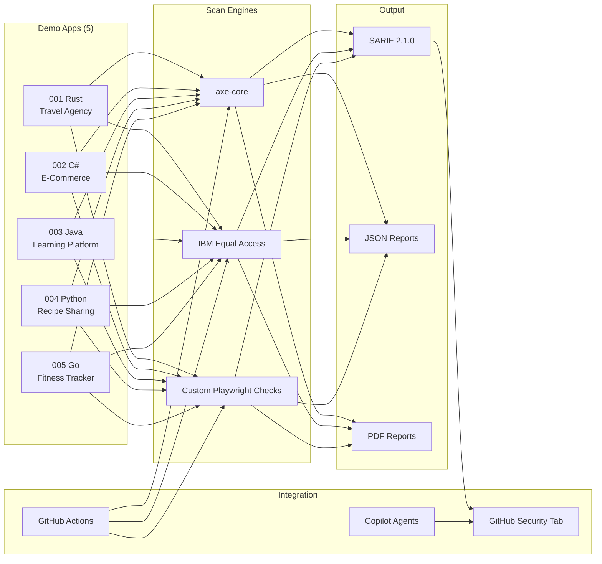
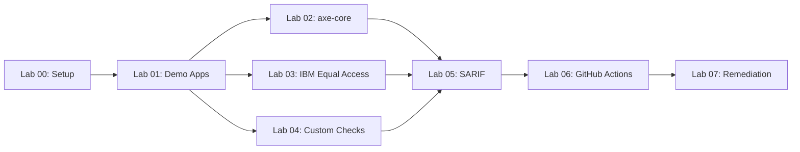

# Accessibility Scan Workshop

Hands-on workshop teaching WCAG 2.2 accessibility scanning using axe-core,
IBM Equal Access, and custom Playwright checks. Students learn to detect,
report, and remediate accessibility violations across 5 intentionally
inaccessible demo web applications built in Rust, C#, Java, Python, and Go.

## Architecture

## Labs

| Lab | Title | Duration | Level |
| --- | --- | --- | --- |
| 00 | Prerequisites and Environment Setup | 30 min | Beginner |
| 01 | Explore the Demo Apps and WCAG Violations | 25 min | Beginner |
| 02 | axe-core — Automated Accessibility Testing | 35 min | Intermediate |
| 03 | IBM Equal Access — Comprehensive Policy Scanning | 30 min | Intermediate |
| 04 | Custom Playwright Checks — Manual Inspection Automation | 35 min | Intermediate |
| 05 | SARIF Output and GitHub Security Tab | 30 min | Intermediate |
| 06 | GitHub Actions Pipelines and Scan Gates | 40 min | Advanced |
| 07 | Remediation Workflows with Copilot Agents | 45 min | Advanced |

## Lab Dependency Diagram

Labs 02, 03, and 04 can be completed in any order after Lab 01.

## Delivery Tiers

| Tier | Labs | Duration | Azure Required |
| --- | --- | --- | --- |
| Half-Day | 00, 01, 02, 03, 05 | ~3 hours | No |
| Full-Day | 00–07 (all) | ~6.5 hours | Yes |

## Tool Stack

| Tool | Purpose |
| --- | --- |
| axe-core | WCAG 2.2 automated rule checking |
| IBM Equal Access | Policy-based accessibility scanning |
| Custom Playwright Checks | Manual inspection automation |
| SARIF | Static Analysis Results Interchange Format |

## Prerequisites

- GitHub account with Copilot access
- Node.js 20+
- Docker Desktop
- Azure subscription (full-day tier only)
- PowerShell 7+
- GitHub CLI (`gh`)
- Azure CLI (`az`) (full-day tier only)

## Quick Start

1. Fork and clone `devopsabcs-engineering/accessibility-scan-demo-app`
2. Run `npm install && npx playwright install --with-deps chromium`
3. Start the scanner: `./start-local.ps1`
4. Open [Lab 00](labs/lab-00-setup.md) and begin

## Contributing

See [CONTRIBUTING.md](CONTRIBUTING.md) for lab authoring guidelines.

## License

[MIT](LICENSE)
