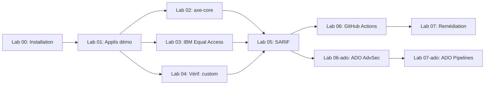

> 🇬🇧 **[English version](../)**

  

# Atelier d'analyse d'accessibilité

Bienvenue dans l'**Atelier d'analyse d'accessibilité** — un atelier pratique et progressif qui vous apprend à analyser les applications web pour détecter les violations d'accessibilité WCAG 2.2 à l'aide d'axe-core, IBM Equal Access et de vérifications personnalisées Playwright.

Tous les résultats sont normalisés au format [SARIF v2.1.0](https://docs.oasis-open.org/sarif/sarif/v2.1.0/sarif-v2.1.0.html) pour un reporting unifié dans GitHub Advanced Security ou Azure DevOps Advanced Security.

> [!NOTE]
> Cet atelier fait partie de l'[Agentic Accelerator Framework](https://github.com/devopsabcs-engineering/agentic-accelerator-framework).

## Vue d'ensemble de l'architecture

## Prérequis

- Compte GitHub avec accès à Copilot
- Node.js 20+
- Docker Desktop
- Abonnement Azure (uniquement pour la journée complète)
- PowerShell 7+

Consultez le [Lab 00 : Prérequis](labs/lab-00-setup.md) pour les instructions d'installation détaillées.

## Ateliers

| # | Atelier | Durée | Niveau |
|---|---------|-------|--------|
| 00 | [Prérequis](labs/lab-00-setup.md) | 30 min | Débutant |
| 01 | [Explorer les applis démo](labs/lab-01.md) | 25 min | Débutant |
| 02 | [axe-core](labs/lab-02.md) | 35 min | Intermédiaire |
| 03 | [IBM Equal Access](labs/lab-03.md) | 30 min | Intermédiaire |
| 04 | [Vérifications Playwright personnalisées](labs/lab-04.md) | 35 min | Intermédiaire |
| 05 | [Sortie SARIF](labs/lab-05.md) | 30 min | Intermédiaire |
| 06 | [GitHub Actions](labs/lab-06.md) | 40 min | Avancé |
| 06-ADO | [ADO Advanced Security](labs/lab-06-ado.md) | 35 min | Intermédiaire |
| 07 | [Remédiation (GitHub)](labs/lab-07.md) | 45 min | Avancé |
| 07-ADO | [Remédiation (ADO)](labs/lab-07-ado.md) | 50 min | Avancé |

## Programme de l'atelier

### Demi-journée (3 heures)

| Horaire | Activité |
|---------|----------|
| 0:00 – 0:30 | Lab 00 : Prérequis |
| 0:30 – 0:55 | Lab 01 : Explorer les applis démo |
| 0:55 – 1:30 | Lab 02 : axe-core |
| 1:30 – 2:00 | Lab 03 : IBM Equal Access |
| 2:00 – 2:15 | Pause |
| 2:15 – 2:55 | Lab 06 : GitHub Actions (ou Lab 06-ADO) |

### Journée complète (6,5 heures)

| Horaire | Activité |
|---------|----------|
| 0:00 – 0:30 | Lab 00 : Prérequis |
| 0:30 – 0:55 | Lab 01 : Explorer les applis démo |
| 0:55 – 1:30 | Lab 02 : axe-core |
| 1:30 – 2:00 | Lab 03 : IBM Equal Access |
| 2:00 – 2:35 | Lab 04 : Vérifications Playwright personnalisées |
| 2:35 – 2:50 | Pause |
| 2:50 – 3:20 | Lab 05 : Sortie SARIF |
| 3:20 – 4:00 | Lab 06 : GitHub Actions |
| 4:00 – 4:35 | Lab 06-ADO : ADO Advanced Security |
| 4:35 – 4:50 | Pause |
| 4:50 – 5:35 | Lab 07 : Remédiation (GitHub) |
| 5:35 – 6:25 | Lab 07-ADO : Remédiation (ADO) |

## Niveaux de prestation

| Niveau | Plateforme | Ateliers | Durée | Azure requis |
| --- | --- | --- | --- | --- |
| Demi-journée (GitHub) | GitHub | 00, 01, 02, 03, 06 | ~3 heures | Non |
| Demi-journée (ADO) | ADO | 00, 01, 02, 03, 06-ado | ~3 heures | Oui |
| Journée complète (GitHub) | GitHub | 00–05, 06, 07 | ~6,5 heures | Oui |
| Journée complète (ADO) | ADO | 00–05, 06-ado, 07-ado | ~7 heures | Oui |
| Journée complète (Double) | Les deux | 00–05, 06, 06-ado, 07, 07-ado | ~8,5 heures | Oui |

## Pour commencer

1. **Forkez ou utilisez ce modèle** pour créer votre propre instance d'atelier.
2. Complétez le [Lab 00 : Prérequis](labs/lab-00-setup.md) pour configurer votre environnement.
3. Suivez les ateliers dans l'ordre — chaque atelier s'appuie sur le précédent.

> **Astuce** : Cet atelier est conçu pour GitHub Codespaces. Cliquez sur **Code → Codespaces → New codespace** pour obtenir un environnement préconfiguré avec tous les outils installés.

## Dépôts associés

| Dépôt | Description |
|-------|-------------|
| [Agentic Accelerator Framework](https://github.com/devopsabcs-engineering/agentic-accelerator-framework) | Définitions d'agents, instructions, compétences et workflows CI/CD |
| [Agentic Accelerator Workshop](https://devopsabcs-engineering.github.io/agentic-accelerator-workshop/) | Atelier pratique pour les agents Accelerator alimentés par l'IA |
| [FinOps Scan Workshop](https://devopsabcs-engineering.github.io/finops-scan-workshop/) | Atelier d'analyse de gouvernance des coûts Azure |
| [Code Quality Scan Workshop](https://devopsabcs-engineering.github.io/code-quality-scan-workshop/) | Atelier d'analyse de qualité du code |
| [APM Security Scan Workshop](https://devopsabcs-engineering.github.io/apm-security-scan-workshop/) | Atelier d'analyse de sécurité des fichiers de configuration d'agents |
