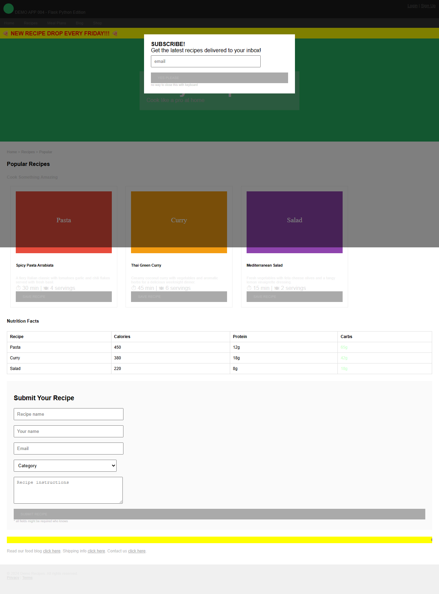
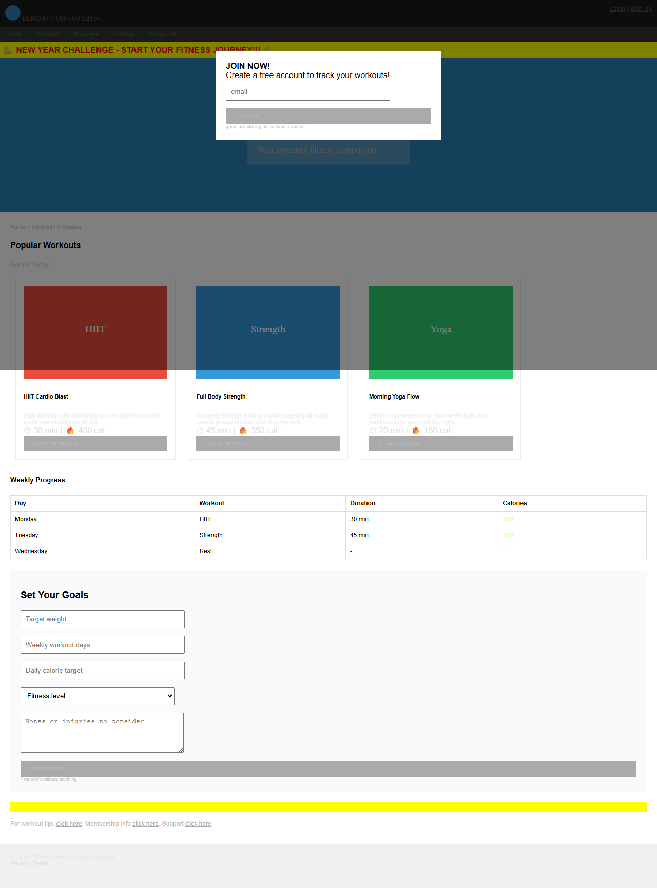

# Labo 01 : Explorer les applications de démonstration et les violations WCAG

| | |
|---|---|
| **Durée** | 25 minutes |
| **Niveau** | Débutant |
| **Prérequis** | [Labo 00](lab-00-setup.md) |

## Objectifs d'apprentissage

À la fin de ce labo, vous serez en mesure de :

- Décrire les 5 applications de démonstration, leurs piles technologiques et leurs thèmes de violations
- Compiler et exécuter une application de démonstration localement avec Docker
- Identifier les violations d'accessibilité visibles dans une page web
- Associer les violations aux principes POUR de WCAG 2.2 (Perceptible, Utilisable, Compréhensible, Robuste)

## Exercices

### Exercice 1.1 : Examiner la matrice des applications de démonstration

Le dépôt du scanner comprend 5 applications web délibérément inaccessibles, chacune construite avec une pile technologique différente. Les 5 applications partagent les mêmes violations WCAG de base mais utilisent des thèmes différents.

1. Examinez la matrice des applications de démonstration :

   | Application | Langage | Framework | Thème | Port | Catégories de violations |
   |-----|----------|-----------|-------|------|----------------------|
   | 001 | Rust | Actix-web | Réservation de voyages | 8001 | Attribut lang manquant, pas de titre, piège de popup, piège clavier, pas d'indicateur de focus, contraste insuffisant, hiérarchie des titres, marquee/blink, pas d'étiquettes, pas d'en-têtes de tableau, liens ambigus |
   | 002 | C# | ASP.NET 8 | Boutique en ligne | 8002 | Tout ce qui précède + interface à onglets inaccessible, carte d'image inaccessible |
   | 003 | Java | Spring Boot | Apprentissage en ligne | 8003 | Mêmes violations de base que 001 avec un contenu sur le thème de l'éducation |
   | 004 | Python | Flask | Site de recettes | 8004 | Mêmes violations de base que 001 avec un contenu sur le thème des recettes |
   | 005 | Go | net/http | Suivi de condition physique | 8005 | Mêmes violations de base que 001 avec un contenu sur le thème du fitness |

2. Notez que les 5 applications incluent intentionnellement plus de 15 catégories de violations WCAG. Ce sont vos cibles de test tout au long de l'atelier.

### Exercice 1.2 : Compiler et exécuter l'application de démonstration 001

Vous allez compiler et exécuter la première application de démonstration localement pour explorer ses violations.

1. Compilez l'image Docker pour l'application de démonstration 001 :

   ```bash
   docker build -t a11y-demo-app-001 ./a11y-demo-app-001
   ```

2. Exécutez le conteneur :

   ```bash
   docker run -d --name a11y-001 -p 8001:8080 a11y-demo-app-001
   ```

3. Ouvrez votre navigateur et accédez à :

   ```text
   http://localhost:8001
   ```

4. Vous devriez voir le site de voyages **TravelNow Bookings**.

   

> [!TIP]
> Pour compiler et exécuter des applications de démonstration supplémentaires, répétez le schéma avec le répertoire et le port appropriés :
>
> ```bash
> docker build -t a11y-demo-app-002 ./a11y-demo-app-002
> docker run -d --name a11y-002 -p 8002:8080 a11y-demo-app-002
> ```
>
> 
>
> 
>
> 
>
> 

### Exercice 1.3 : Identifier les violations visibles

Vous allez explorer l'application de démonstration 001 et identifier les violations d'accessibilité visibles sans aucun outil.

1. Lorsque la page se charge, remarquez la **fenêtre popup modale** qui apparaît. Essayez d'appuyer sur `Tab` ou `Escape` — la modale ne peut pas être fermée au clavier.

   

2. Fermez la modale en cliquant sur le bouton X avec votre souris. Puis observez les éléments suivants :

   - **Texte alternatif manquant** — Les images de destinations (Paris, Tokyo, Bali) n'ont pas de texte alternatif. Survolez-les et remarquez qu'aucune infobulle n'apparaît.
   - **Contraste de couleurs insuffisant** — Le texte à travers la page utilise des couleurs claires sur des arrière-plans foncés (par exemple, du texte gris sur des sections gris foncé).
   - **Hiérarchie des titres** — La page passe de `<h4>` à `<h1>` puis à `<h6>`, violant l'ordre logique des titres.
   - **Texte minuscule** — Plusieurs éléments utilisent des tailles de police de 9px ou 11px, les rendant difficiles à lire.
   - **Élément marquee** — Une bannière défilante `<marquee>` crée un mouvement distrayant.
   - **Liens « cliquez ici »** — Les liens utilisent un texte vague comme « cliquez ici » au lieu de décrire leur destination.

3. Ouvrez Chrome DevTools (`F12`) et lancez un **audit d'accessibilité Lighthouse** :
   - Accédez à l'onglet **Lighthouse**
   - Sélectionnez **Accessibility** comme catégorie
   - Cliquez sur **Analyze page load**

   

4. Examinez le score Lighthouse. L'application de démonstration 001 obtient généralement un score inférieur à 50 en raison du volume de violations.

### Exercice 1.4 : Associer les violations aux principes WCAG

WCAG 2.2 organise les exigences d'accessibilité en 4 principes connus sous le nom de **POUR**. Vous allez associer les violations trouvées à ces principes.

1. Examinez les principes POUR et leurs exemples dans les applications de démonstration :

   | Principe | Description | Exemples dans les applications de démonstration |
   |-----------|-------------|-------------------|
   | **Perceptible** | L'information doit être présentée de manière perceptible par les utilisateurs | Texte alternatif manquant (1.1.1), contraste insuffisant (1.4.3), texte minuscule (1.4.4) |
   | **Utilisable** | Les composants d'interface doivent être utilisables par tous les utilisateurs | Piège clavier (2.1.2), pas de lien d'évitement (2.4.1), pas de titre de page (2.4.2), liens ambigus (2.4.4), marquee/blink (2.3.1) |
   | **Compréhensible** | L'information et le fonctionnement de l'interface doivent être compréhensibles | Attribut lang manquant (3.1.1), pas d'étiquettes de formulaire (3.3.2) |
   | **Robuste** | Le contenu doit être suffisamment robuste pour les technologies d'assistance | Éléments obsolètes comme `<font>` et `<marquee>` (4.1.1), divs utilisés comme boutons sans rôles ARIA (4.1.2) |

   

2. Pour chaque violation identifiée dans l'exercice 1.3, déterminez à quel principe POUR elle appartient. La plupart des violations des applications de démonstration couvrent les 4 principes.

> [!NOTE]
> WCAG 2.2 Niveau AA comporte 55 critères de succès répartis entre ces 4 principes. Les applications de démonstration violent des critères de chaque principe, ce qui en fait des cibles de test complètes pour les outils de scanner que vous utiliserez dans les labos 02 à 04.

## Point de vérification

Avant de continuer, vérifiez que :

- [ ] Vous pouvez nommer les 5 applications de démonstration et leurs piles technologiques
- [ ] L'application de démonstration 001 est en cours d'exécution à `http://localhost:8001`
- [ ] Vous avez identifié au moins 5 violations visibles dans l'application de démonstration 001
- [ ] Vous pouvez expliquer les 4 principes WCAG POUR avec des exemples tirés des applications de démonstration

## Prochaines étapes

Passez au [Labo 02 : axe-core — Tests d'accessibilité automatisés](lab-02.md).
