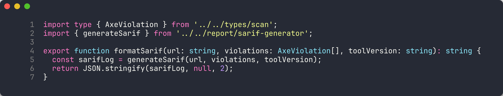
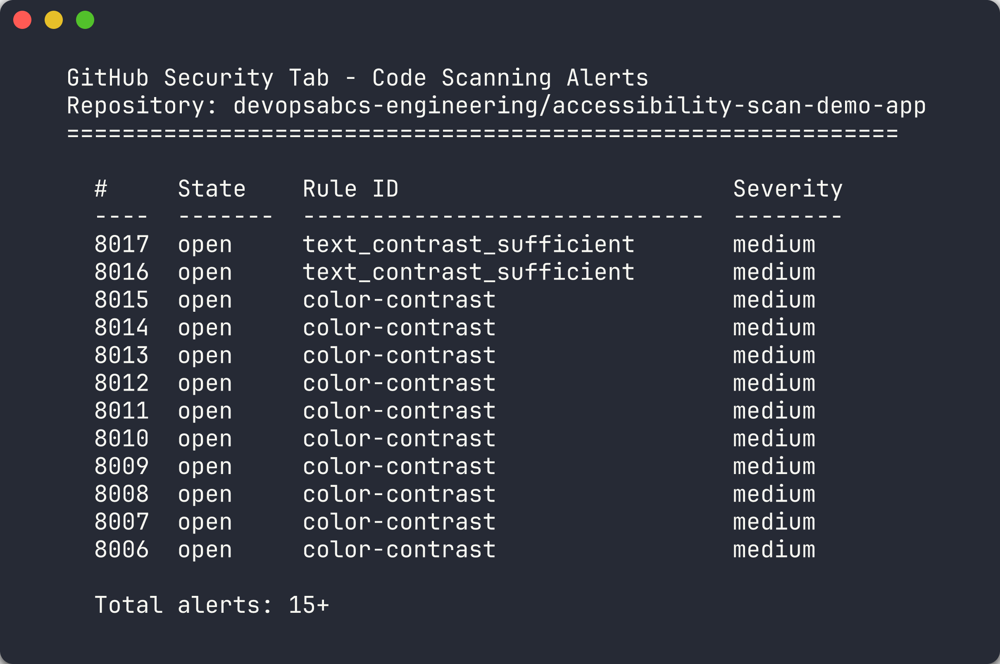
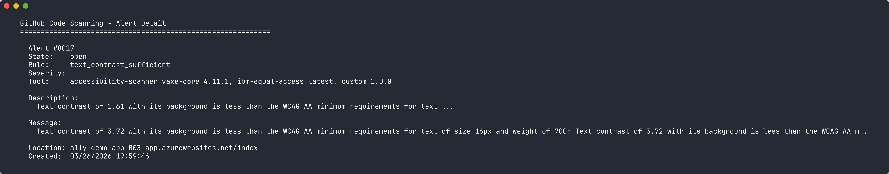
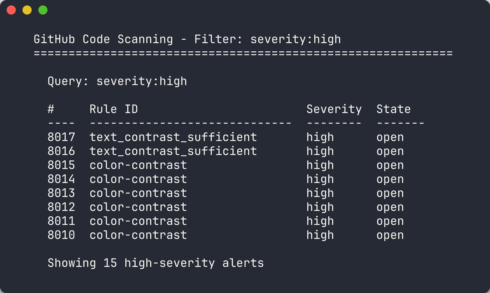
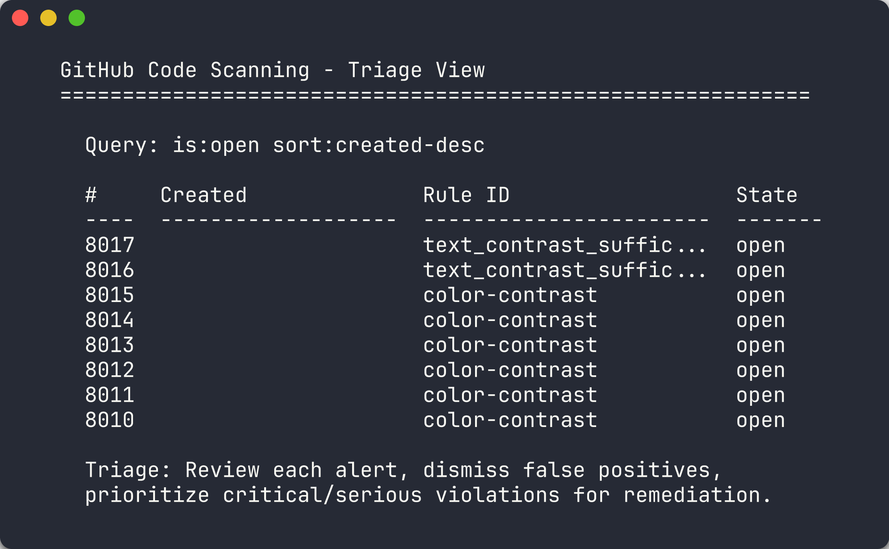

# Labo 05 : Sortie SARIF et onglet Sécurité GitHub

| | |
|---|---|
| **Durée** | 30 minutes |
| **Niveau** | Intermédiaire |
| **Prérequis** | [Labo 02](lab-02.md), [Labo 03](lab-03.md) ou [Labo 04](lab-04.md) (au moins un) |

## Objectifs d'apprentissage

À la fin de ce labo, vous serez en mesure de :

- Générer des résultats d'analyse d'accessibilité au format SARIF v2.1.0
- Expliquer le schéma SARIF, y compris les exécutions, résultats, règles et emplacements
- Téléverser des fichiers SARIF vers l'onglet Sécurité de GitHub à l'aide de l'action CodeQL
- Naviguer dans l'onglet Sécurité de GitHub pour consulter les alertes d'accessibilité
- Trier les résultats en filtrant, rejetant et catégorisant les alertes

## Exercices

### Exercice 5.1 : Générer une sortie SARIF

Vous allez générer des résultats d'analyse d'accessibilité au format SARIF utilisé par GitHub Code Scanning.

1. Créez un répertoire de résultats s'il n'existe pas déjà :

   ```bash
   mkdir -p results
   ```

2. Exécutez le scanner avec une sortie SARIF :

   ```bash
   npx ts-node src/cli/commands/scan.ts --url http://localhost:8001 --format sarif --output results/a11y-001.sarif
   ```

3. Vérifiez que le fichier SARIF a été créé :

   ```bash
   ls -la results/a11y-001.sarif
   ```

   

### Exercice 5.2 : Examiner la structure SARIF

Vous allez parcourir le schéma SARIF v2.1.0 pour comprendre comment les résultats d'accessibilité sont représentés.

1. Ouvrez `results/a11y-001.sarif` dans votre éditeur. La structure de niveau supérieur est :

   ```json
   {
     "$schema": "https://raw.githubusercontent.com/oasis-tcs/sarif-spec/main/sarif-2.1/schema/sarif-schema-2.1.0.json",
     "version": "2.1.0",
     "runs": [...]
   }
   ```

2. Chaque **exécution** (run) représente une analyse et contient :

   | Section | Description |
   |---------|-------------|
   | `tool` | L'identité et la version de l'outil d'analyse |
   | `tool.driver.rules` | Tableau de définitions de règles avec identifiants, descriptions et URLs d'aide |
   | `results` | Tableau des résultats individuels |
   | `results[].ruleId` | La règle qui a été enfreinte |
   | `results[].level` | Sévérité : `error`, `warning` ou `note` |
   | `results[].message` | Description lisible du résultat |
   | `results[].locations` | Emplacement de la violation (URI et région) |

   

3. Examinez la correspondance entre les niveaux de sévérité axe-core et SARIF :

   | Impact axe-core | Niveau SARIF |
   |-----------------|--------------|
   | critical | error |
   | serious | error |
   | moderate | warning |
   | minor | note |

4. Examinez une entrée de résultat individuelle :

   ```json
   {
     "ruleId": "image-alt",
     "level": "error",
     "message": {
       "text": "Images must have alternate text"
     },
     "locations": [
       {
         "physicalLocation": {
           "artifactLocation": {
             "uri": "http://localhost:8001"
           }
         }
       }
     ]
   }
   ```

### Exercice 5.3 : Téléverser le SARIF vers GitHub

Vous allez téléverser le fichier SARIF vers l'onglet Sécurité de votre fork à l'aide de l'action GitHub CodeQL.

1. Créez un fichier de workflow à `.github/workflows/upload-sarif.yml` dans votre fork :

   ```yaml
   name: Upload SARIF

   on:
     workflow_dispatch:
       inputs:
         sarif_file:
           description: 'Path to SARIF file'
           required: true
           default: 'results/a11y-001.sarif'

   permissions:
     security-events: write

   jobs:
     upload:
       runs-on: ubuntu-latest
       steps:
         - uses: actions/checkout@v4

         - name: Upload SARIF
           uses: github/codeql-action/upload-sarif@v4
           with:
             sarif_file: ${{ github.event.inputs.sarif_file }}
             category: accessibility-scan
   ```

2. Validez et poussez le workflow vers votre fork :

   ```bash
   git add .github/workflows/upload-sarif.yml
   git commit -m "feat: add SARIF upload workflow"
   git push
   ```

3. Assurez-vous que le fichier SARIF est également validé :

   ```bash
   git add results/a11y-001.sarif
   git commit -m "feat: add sample SARIF scan results"
   git push
   ```

4. Déclenchez le workflow :

   ```bash
   gh workflow run upload-sarif.yml
   ```

5. Attendez la fin de l'exécution du workflow :

   ```bash
   gh run watch
   ```

> [!NOTE]
> L'action `github/codeql-action/upload-sarif@v4` nécessite la permission `security-events: write`. GitHub Advanced Security doit être activé sur votre dépôt (il est activé par défaut sur les dépôts publics).

### Exercice 5.4 : Parcourir les résultats dans l'onglet Sécurité

Vous allez naviguer dans l'onglet Sécurité de GitHub pour consulter les alertes d'accessibilité téléversées.

1. Ouvrez votre fork sur GitHub dans un navigateur.

2. Accédez à l'onglet **Sécurité**, puis cliquez sur **Code scanning**.

3. Vous devriez voir les alertes d'accessibilité regroupées par règle. Chaque alerte affiche :
   - L'identifiant et la description de la règle
   - La sévérité (error, warning, note)
   - L'URL affectée

   

4. Cliquez sur une alerte individuelle pour afficher ses détails complets, y compris le texte d'aide de la règle et le critère WCAG.

   

### Exercice 5.5 : Trier les résultats

Vous allez vous exercer à filtrer et gérer les alertes dans l'onglet Sécurité.

1. Utilisez le filtre de **sévérité** pour afficher uniquement les alertes de niveau `error` (violations critiques et sérieuses) :

   

2. Cliquez sur une alerte de faible sévérité et cliquez sur **Rejeter l'alerte**. Sélectionnez une raison :
   - **Faux positif** — si le résultat est incorrect
   - **Ne sera pas corrigé** — si le résultat est intentionnel
   - **Utilisé dans les tests** — si le code est un artefact de test

   

3. Notez que les alertes rejetées restent visibles avec un texte barré. Vous pouvez les rouvrir ultérieurement si nécessaire.

> [!TIP]
> Dans un projet réel, triez les alertes dans le cadre de la revue de sprint de votre équipe. Les violations critiques et sérieuses doivent être traitées immédiatement, tandis que les problèmes modérés et mineurs peuvent être suivis pour les sprints futurs.

## Point de vérification

Avant de continuer, vérifiez que vous avez :

- [ ] Généré un fichier SARIF à partir du CLI du scanner
- [ ] Pu décrire les 4 sections principales du SARIF (schéma, exécutions, outil/règles, résultats)
- [ ] Téléversé un fichier SARIF vers GitHub via le workflow upload-sarif
- [ ] Consulté les alertes d'accessibilité dans l'onglet Sécurité de GitHub
- [ ] Trié au moins 1 alerte (rejetée ou examinée)

> [!NOTE]
> **Choisissez votre parcours :** Si vous suivez le parcours GitHub, continuez vers
> [Labo 06 : GitHub Actions](lab-06.md). Si vous suivez le parcours Azure DevOps,
> continuez vers [Labo 06-ado : ADO Advanced Security](lab-06-ado.md).

## Prochaines étapes

Passez au [Labo 06 : Pipelines GitHub Actions et portes d'analyse](lab-06.md).
