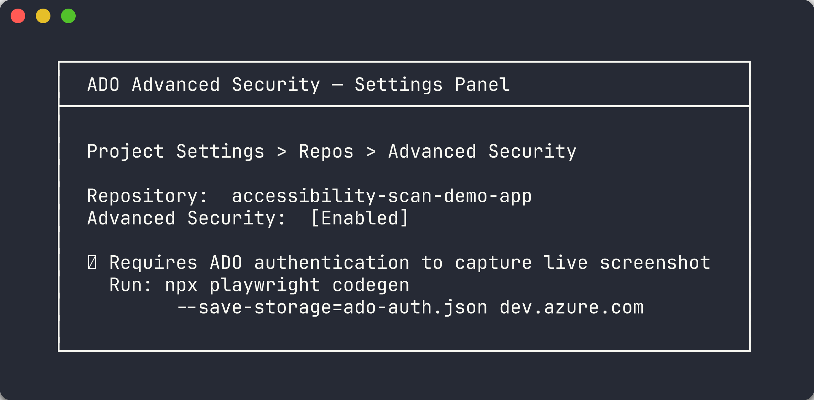
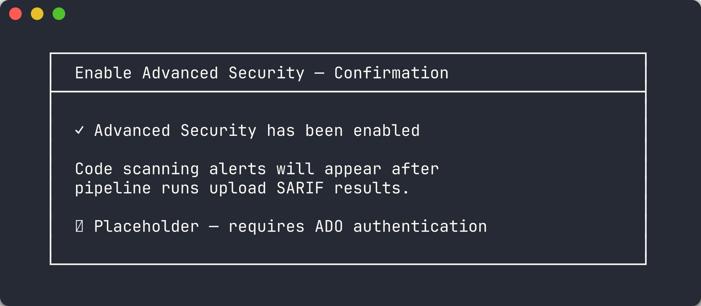
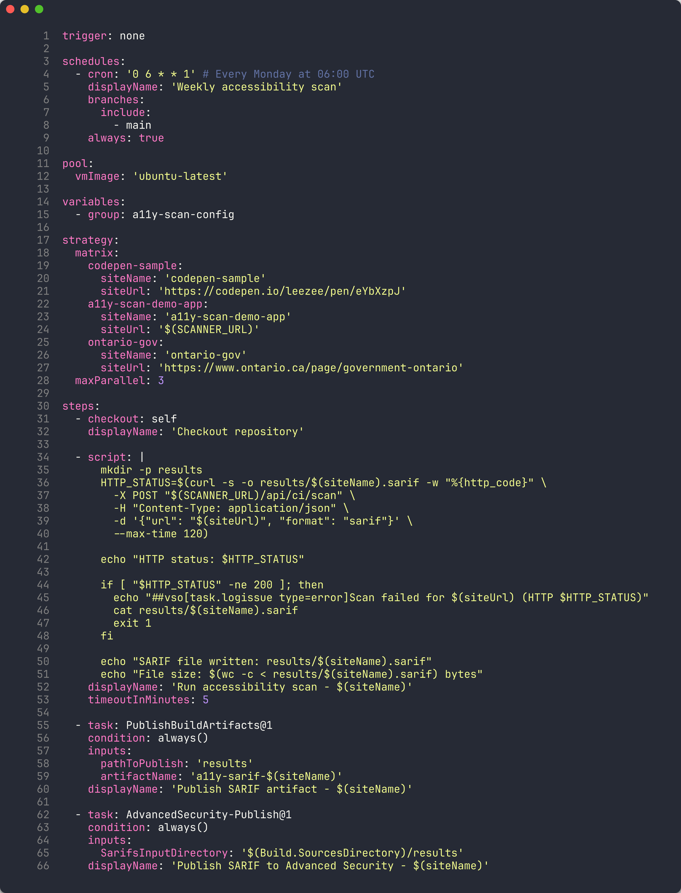
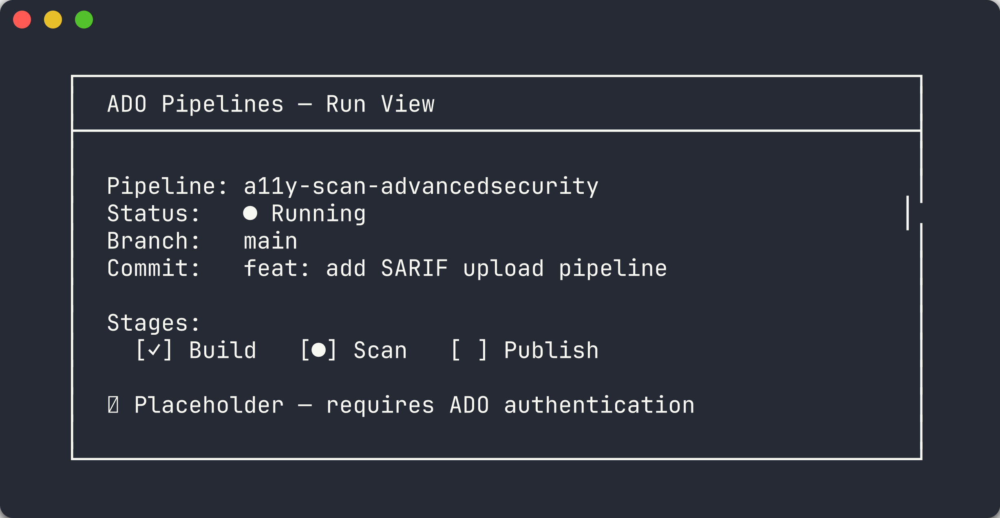
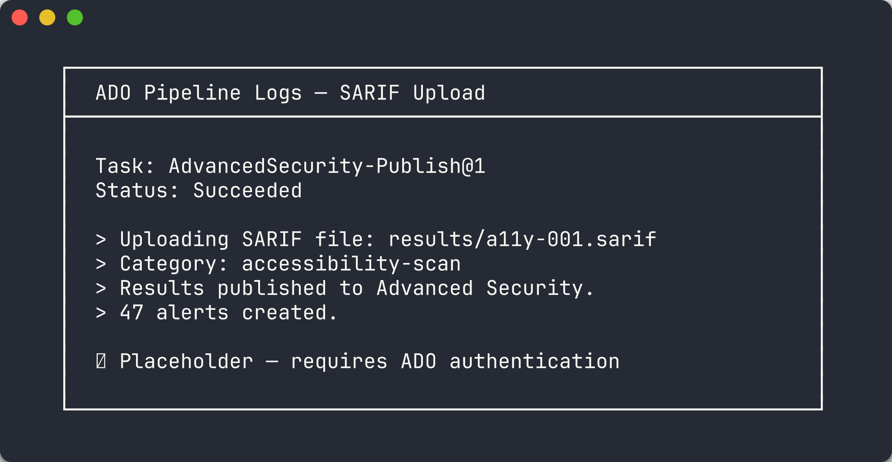
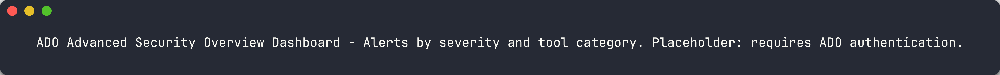
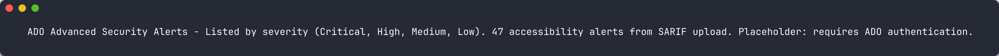

# Labo 06-ado : ADO Advanced Security et intégration SARIF

| | |
|---|---|
| **Durée** | 35 min |
| **Niveau** | Intermédiaire |
| **Prérequis** | [Labo 05](lab-05.md) |
| **Plateforme** | Azure DevOps |

## Objectifs d'apprentissage

À la fin de ce labo, vous serez en mesure de :

- Examiner les fichiers de sortie SARIF des labos d'analyse précédents
- Activer GHAzDO Advanced Security sur un projet ADO
- Créer un pipeline YAML ADO utilisant AdvancedSecurity-Publish@1
- Exécuter le pipeline et surveiller son exécution
- Consulter les résultats dans l'aperçu ADO Advanced Security
- Comparer ADO Advanced Security avec l'onglet GitHub Security

## Exercices

### Exercice 6.1 : Examiner la sortie SARIF des labos précédents (5 min)

Vous allez examiner les fichiers SARIF générés lors des labos 02 à 05 pour comprendre leur structure avant de les publier vers ADO Advanced Security.

1. Ouvrez l'un des fichiers SARIF de vos résultats d'analyse précédents (par exemple, `results/demo-001.sarif`).

2. Examinez la structure SARIF v2.1.0. Chaque fichier SARIF suit ce schéma :

   ```json
   {
     "$schema": "https://raw.githubusercontent.com/oasis-tcs/sarif-spec/main/sarif-2.1/schema/sarif-schema-2.1.0.json",
     "version": "2.1.0",
     "runs": [
       {
         "tool": {
           "driver": {
             "name": "axe-core",
             "version": "4.x",
             "rules": [ ... ]
           }
         },
         "results": [
           {
             "ruleId": "color-contrast",
             "level": "error",
             "message": { "text": "..." },
             "locations": [ ... ]
           }
         ]
       }
     ]
   }
   ```

3. Notez les éléments clés :

   | Élément | Objectif |
   |---------|----------|
   | `$schema` | Déclare la conformité SARIF v2.1.0 |
   | `runs[].tool.driver` | Identifie le moteur d'analyse (axe-core, IBM Equal Access ou personnalisé) |
   | `runs[].results[]` | Violations d'accessibilité individuelles avec sévérité, emplacement et message |

   

4. Confirmez que vous disposez d'au moins un fichier SARIF valide. ADO Advanced Security consomme ces fichiers via la tâche de pipeline `AdvancedSecurity-Publish@1`.

### Exercice 6.2 : Activer GHAzDO Advanced Security (10 min)

Vous allez activer Azure DevOps Advanced Security (GHAzDO) sur le projet `AODA WCAG Compliance` dans l'organisation `MngEnvMCAP675646`.

1. Accédez à votre projet ADO :

   ```text
   https://dev.azure.com/MngEnvMCAP675646/AODA%20WCAG%20Compliance
   ```

2. Ouvrez **Paramètres du projet** (icône d'engrenage en bas à gauche du portail ADO).

3. Sous **Repos**, sélectionnez **Advanced Security**.

   

4. Activez Advanced Security au **niveau du projet** :
   - Basculez **Advanced Security** sur **Activé**
   - Consultez l'avis de facturation — Advanced Security est facturé par contributeur actif
   - Confirmez l'activation

5. Vérifiez qu'Advanced Security est activé pour chaque dépôt du projet. Chaque dépôt affiche un badge **Activé** à côté de son nom.

   

6. Après l'activation, vous verrez de nouveaux éléments de menu sous **Advanced Security** :
   - **Vue d'ensemble** — Tableau de bord affichant les alertes par sévérité
   - **Alertes** — Liste détaillée des alertes avec filtrage

### Exercice 6.3 : Créer un pipeline YAML ADO avec AdvancedSecurity-Publish@1 (10 min)

Vous allez examiner le pipeline YAML ADO qui publie les résultats SARIF vers Advanced Security à l'aide de la tâche `AdvancedSecurity-Publish@1`.

1. Ouvrez `.azuredevops/pipelines/a11y-scan-advancedsecurity.yml` dans votre éditeur.

2. Examinez la structure du pipeline :

   ```yaml
   trigger:
     branches:
       include:
         - main

   pool:
     vmImage: 'ubuntu-latest'

   steps:
     - checkout: self

     - task: NodeTool@0
       inputs:
         versionSpec: '20.x'

     - script: |
         npm ci
         npx playwright install --with-deps chromium
       displayName: 'Install dependencies'

     - script: |
         npx ts-node src/cli/commands/scan.ts \
           --url $(APP_URL) \
           --format sarif \
           --output $(Build.ArtifactStagingDirectory)/a11y-results.sarif
       displayName: 'Run accessibility scan'

     - task: AdvancedSecurity-Publish@1
       inputs:
         sarifInputFilePath: '$(Build.ArtifactStagingDirectory)/a11y-results.sarif'
         category: 'accessibility'
       displayName: 'Publish SARIF to Advanced Security'
   ```

3. Notez les éléments clés de `AdvancedSecurity-Publish@1` :

   | Entrée | Objectif |
   |--------|----------|
   | `sarifInputFilePath` | Chemin vers le fichier SARIF généré par l'étape d'analyse |
   | `category` | Regroupe les alertes sous une catégorie dans le tableau de bord Advanced Security |

   

4. Le pipeline exécute l'analyse d'accessibilité et publie les résultats en un seul travail. ADO Advanced Security ingère le fichier SARIF et crée des alertes pour chaque résultat.

### Exercice 6.4 : Exécuter le pipeline et observer l'exécution (5 min)

Vous allez déclencher le pipeline et surveiller son exécution dans l'interface Pipelines d'ADO.

1. Accédez à **Pipelines** dans le portail ADO.

2. Sélectionnez le pipeline **a11y-scan-advancedsecurity**.

3. Cliquez sur **Exécuter le pipeline** et acceptez la branche par défaut (`main`).

   

4. Surveillez l'exécution du pipeline :
   - Observez chaque étape se terminer dans la vue du travail
   - Cliquez sur les étapes individuelles pour consulter leurs journaux
   - L'étape **Publish SARIF to Advanced Security** affiche l'état du téléversement

5. Consultez les journaux du pipeline pour l'étape de publication. Vous devriez voir une sortie confirmant l'ingestion du fichier SARIF :

   ```text
   Uploading SARIF file: a11y-results.sarif
   Category: accessibility
   Results published to Advanced Security
   ```

   

6. Attendez que le pipeline se termine avec succès avant de poursuivre.

### Exercice 6.5 : Consulter les résultats dans l'aperçu ADO Advanced Security (5 min)

Vous allez accéder au tableau de bord Advanced Security et examiner les alertes d'accessibilité.

1. Accédez à **Advanced Security** → **Vue d'ensemble** dans le portail ADO :

   ```text
   https://advsec.dev.azure.com/MngEnvMCAP675646/AODA%20WCAG%20Compliance/
   ```

2. Le tableau de bord Vue d'ensemble affiche :
   - Le nombre total d'alertes
   - Les alertes regroupées par sévérité (Critique, Élevée, Moyenne, Faible)
   - Les alertes regroupées par outil (axe-core, IBM Equal Access, personnalisé)
   - Un graphique de tendance montrant les alertes au fil du temps

   

3. Cliquez sur **Alertes** pour voir la liste détaillée des alertes. Chaque alerte affiche :
   - L'identifiant de la règle et sa description
   - Le niveau de sévérité
   - L'emplacement du fichier et le numéro de ligne
   - L'outil qui a détecté la violation

   

4. Cliquez sur une alerte individuelle pour voir ses détails, y compris le message SARIF, l'emplacement du code concerné et les recommandations de remédiation.

### Exercice 6.6 : Comparer avec l'onglet GitHub Security (5 min)

Vous allez comparer l'expérience ADO Advanced Security avec l'onglet GitHub Security du labo 05.

1. Ouvrez l'aperçu ADO Advanced Security et l'onglet GitHub Security côte à côte.

2. Comparez les aspects suivants :

   | Aspect | Onglet GitHub Security | ADO Advanced Security |
   |--------|------------------------|-----------------------|
   | **Regroupement des alertes** | Par outil et sévérité | Par sévérité, outil et catégorie |
   | **Attribution de l'outil SARIF** | Affiche le nom de l'outil depuis le pilote SARIF | Affiche le nom de l'outil et la catégorie |
   | **Flux de remédiation** | Créer un ticket depuis l'alerte, lier à une PR | Créer un élément de travail depuis l'alerte, lier à AB# |
   | **Fermeture d'alerte** | Fermer avec motif | Fermer avec état de résolution |
   | **Accès API** | REST API et GraphQL | REST API |

3. Notez la différence clé dans les flux de remédiation :
   - GitHub utilise des **tickets et des pull requests** pour le suivi des corrections
   - ADO utilise des **éléments de travail et le lien AB#** pour le suivi des corrections (voir labo 07-ado pour plus de détails)

   

4. Les deux plateformes consomment le même format SARIF, les résultats d'analyse sont donc identiques. La différence réside dans la manière dont chaque plateforme présente et gère les alertes.

## Point de vérification

Avant de poursuivre, vérifiez :

- [ ] Examiné la structure du fichier SARIF et compris le schéma v2.1.0
- [ ] Activé GHAzDO Advanced Security sur le projet ADO
- [ ] Examiné le pipeline YAML `AdvancedSecurity-Publish@1`
- [ ] Exécuté le pipeline et confirmé le téléversement SARIF réussi
- [ ] Consulté les alertes dans l'aperçu ADO Advanced Security
- [ ] Comparé ADO Advanced Security avec l'onglet GitHub Security

## Prochaines étapes

Passez au [Labo 07-ado : Pipelines YAML ADO pour l'analyse d'accessibilité](lab-07-ado.md).
