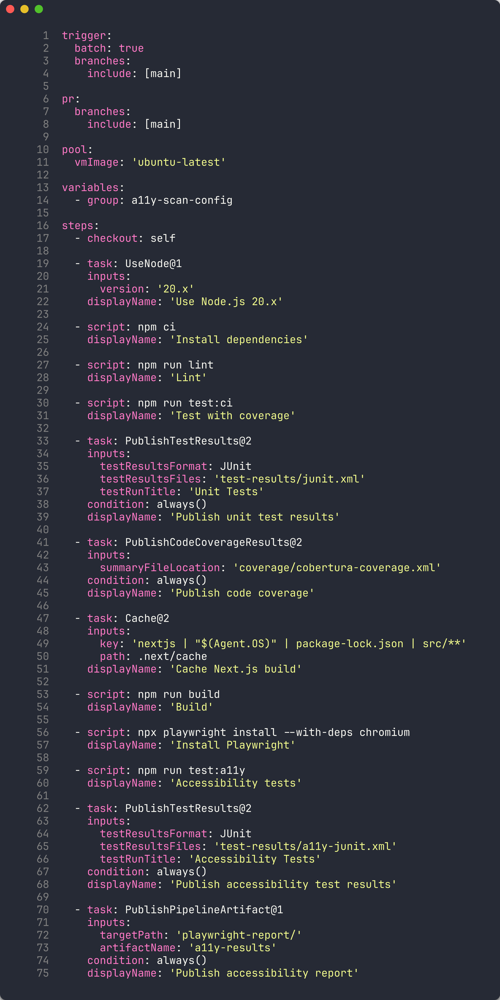
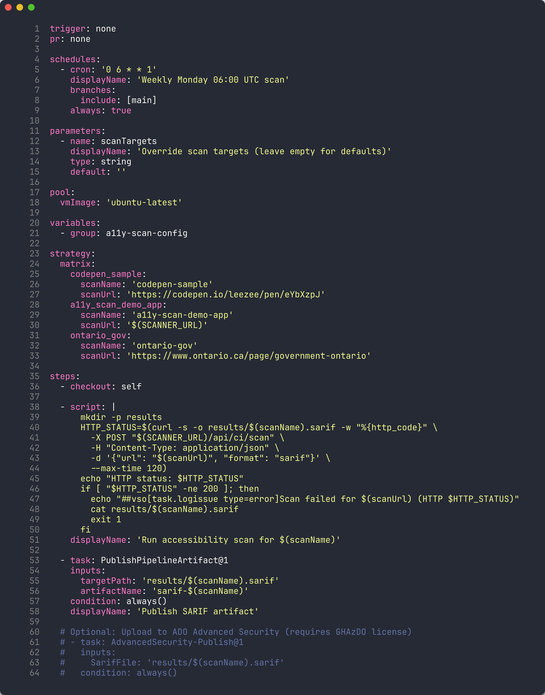
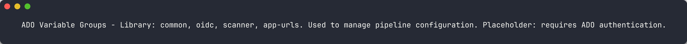
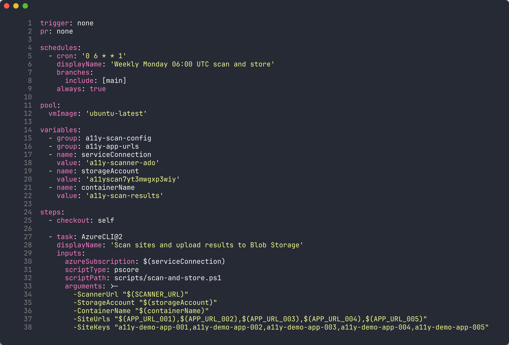
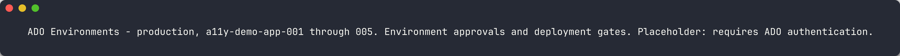
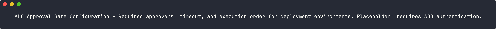
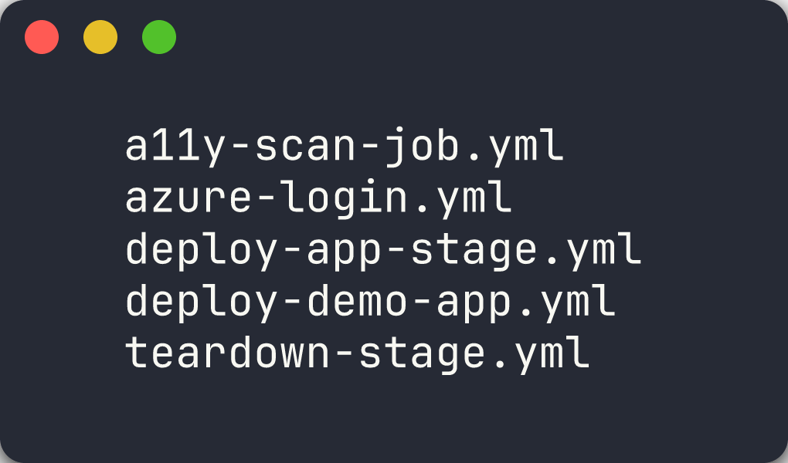
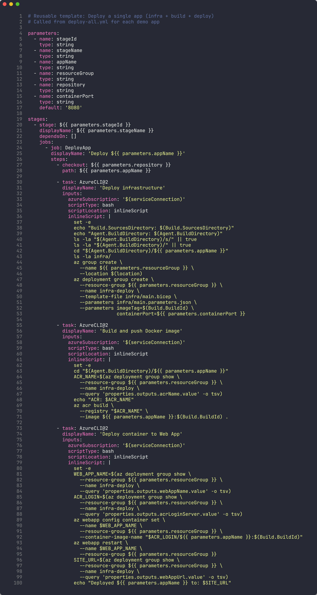
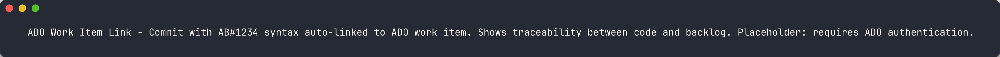

# Labo 07-ado : Pipelines YAML ADO pour l'analyse d'accessibilité

| | |
|---|---|
| **Durée** | 50 min |
| **Niveau** | Avancé |
| **Prérequis** | [Labo 06-ado](lab-06-ado.md) |
| **Plateforme** | Azure DevOps |

## Objectifs d'apprentissage

À la fin de ce labo, vous serez en mesure de :

- Comprendre la syntaxe des pipelines YAML ADO et la comparer avec GitHub Actions
- Configurer un pipeline multi-étapes avec une stratégie de matrice
- Utiliser des groupes de variables pour gérer la configuration des pipelines
- Mettre en place des déclencheurs planifiés avec la syntaxe cron
- Configurer les approbations d'environnement et les portes de déploiement
- Créer des modèles de pipeline réutilisables avec des paramètres
- Lier les commits et les PR aux éléments de travail ADO en utilisant la syntaxe AB#

## Exercices

### Exercice 7.1 : Bases des pipelines YAML ADO (10 min)

Vous allez examiner le pipeline CI pour comprendre la syntaxe des pipelines YAML ADO et la comparer avec GitHub Actions.

1. Ouvrez `.azuredevops/pipelines/ci.yml` dans votre éditeur.

2. Examinez la structure du pipeline :

   ```yaml
   trigger:
     branches:
       include:
         - main

   pr:
     branches:
       include:
         - main

   pool:
     vmImage: 'ubuntu-latest'

   stages:
     - stage: Build
       jobs:
         - job: BuildAndTest
           steps:
             - checkout: self
             - task: NodeTool@0
               inputs:
                 versionSpec: '20.x'
             - script: npm ci
               displayName: 'Install dependencies'
             - script: npm run build
               displayName: 'Build project'
             - script: npm test
               displayName: 'Run tests'
   ```

3. Comparez la syntaxe avec GitHub Actions :

   | Concept | GitHub Actions | Pipelines YAML ADO |
   |---------|---------------|--------------------|
   | **Déclencheur** | `on: push` | `trigger: branches: include:` |
   | **Déclencheur PR** | `on: pull_request` | `pr: branches: include:` |
   | **Agent** | `runs-on: ubuntu-latest` | `pool: vmImage: 'ubuntu-latest'` |
   | **Hiérarchie** | `jobs → steps` | `stages → jobs → steps` |
   | **Tâche** | `uses: actions/setup-node@v4` | `task: NodeTool@0` |
   | **Script** | `run: npm ci` | `script: npm ci` |

   

4. Les pipelines ADO ajoutent une couche **stages** au-dessus des jobs, permettant des flux de travail multi-étapes avec des approbations entre les étapes.

### Exercice 7.2 : Pipeline d'analyse multi-étapes (10 min)

Vous allez examiner le pipeline d'analyse qui utilise une stratégie de matrice pour analyser plusieurs applications de démonstration.

1. Ouvrez `.azuredevops/pipelines/a11y-scan.yml` dans votre éditeur.

2. Examinez la stratégie de matrice :

   ```yaml
   stages:
     - stage: Scan
       jobs:
         - job: ScanApps
           strategy:
             matrix:
               App001:
                 APP_NAME: 'a11y-demo-app-001'
                 APP_URL: 'https://a11y-demo-app-001.azurewebsites.net'
               App002:
                 APP_NAME: 'a11y-demo-app-002'
                 APP_URL: 'https://a11y-demo-app-002.azurewebsites.net'
               App003:
                 APP_NAME: 'a11y-demo-app-003'
                 APP_URL: 'https://a11y-demo-app-003.azurewebsites.net'
           steps:
             - script: |
                 npx ts-node src/cli/commands/scan.ts \
                   --url $(APP_URL) \
                   --format sarif \
                   --output $(Build.ArtifactStagingDirectory)/$(APP_NAME).sarif
               displayName: 'Scan $(APP_NAME)'

             - task: AdvancedSecurity-Publish@1
               inputs:
                 sarifInputFilePath: '$(Build.ArtifactStagingDirectory)/$(APP_NAME).sarif'
                 category: 'accessibility'
   ```

3. Comparez la syntaxe de matrice :

   | Aspect | GitHub Actions | Pipelines YAML ADO |
   |--------|---------------|--------------------|
   | **Déclaration** | `strategy: matrix: app: [001, 002]` | `strategy: matrix: App001: ...` |
   | **Accès aux variables** | `${{ matrix.app }}` | `$(APP_NAME)` |
   | **Entrées nommées** | Implicite à partir des valeurs du tableau | Clés nommées explicites (App001, App002) |

   

4. Chaque entrée de matrice s'exécute comme un job parallèle, analysant une application de démonstration et publiant ses résultats SARIF dans Advanced Security.

### Exercice 7.3 : Groupes de variables pour la configuration (5 min)

Vous allez examiner les groupes de variables qui centralisent la configuration des pipelines.

1. Accédez à **Pipelines** → **Library** dans le portail ADO.

2. Examinez les 4 groupes de variables utilisés par les pipelines d'analyse :

   | Groupe de variables | Objectif | Variables clés |
   |---------------------|----------|----------------|
   | `common` | Paramètres partagés | `NODE_VERSION`, `PLAYWRIGHT_VERSION` |
   | `oidc` | Identifiants OIDC Azure | `AZURE_CLIENT_ID`, `AZURE_TENANT_ID`, `AZURE_SUBSCRIPTION_ID` |
   | `scanner` | Configuration du scanner | `SCANNER_THRESHOLD`, `SARIF_OUTPUT_DIR` |
   | `app-urls` | URL des applications de démonstration | `APP_URL_001` à `APP_URL_005` |

   

3. Les groupes de variables sont référencés dans le YAML du pipeline à l'aide de la section `variables` :

   ```yaml
   variables:
     - group: common
     - group: scanner
     - group: app-urls
   ```

4. Les groupes de variables vous permettent de gérer la configuration partagée en un seul endroit. La mise à jour d'une valeur de groupe de variables s'applique automatiquement à tous les pipelines qui le référencent.

### Exercice 7.4 : Déclencheurs planifiés avec Cron (5 min)

Vous allez examiner comment les pipelines ADO utilisent des déclencheurs planifiés basés sur cron pour des analyses récurrentes automatisées.

1. Ouvrez `.azuredevops/pipelines/scan-and-store.yml` dans votre éditeur.

2. Examinez la syntaxe du déclencheur planifié :

   ```yaml
   schedules:
     - cron: '0 6 * * 1'
       displayName: 'Weekly Monday 06:00 UTC'
       branches:
         include:
           - main
       always: true
   ```

3. Comprenez les champs cron :

   | Champ | Valeur | Signification |
   |-------|--------|---------------|
   | Minute | `0` | À la minute 0 |
   | Heure | `6` | À 06:00 UTC |
   | Jour du mois | `*` | Chaque jour |
   | Mois | `*` | Chaque mois |
   | Jour de la semaine | `1` | Lundi uniquement |

   

4. Le paramètre `always: true` garantit que le pipeline s'exécute même en l'absence de modifications de code depuis la dernière exécution. Cela est important pour les analyses d'accessibilité planifiées — vous souhaitez détecter les régressions indépendamment de l'activité du code.

### Exercice 7.5 : Approbations d'environnement et portes de contrôle (5 min)

Vous allez examiner comment les environnements ADO appliquent des flux de travail d'approbation avant le déploiement.

1. Accédez à **Pipelines** → **Environments** dans le portail ADO.

2. Examinez les environnements configurés :

   | Environnement | Objectif | Approbation requise |
   |---------------|----------|---------------------|
   | `production` | Porte de déploiement en production | Oui — approbation manuelle requise |
   | `a11y-demo-app-001` | Déploiement par application | Non — approbation automatique |
   | `a11y-demo-app-002` | Déploiement par application | Non — approbation automatique |

   

3. Ouvrez l'environnement `production` et examinez la configuration de la porte d'approbation :
   - **Approbateurs** — Un ou plusieurs membres de l'équipe qui doivent approuver avant que le déploiement puisse continuer
   - **Délai d'expiration** — Temps d'attente maximum pour l'approbation avant que le pipeline échoue
   - **Instructions** — Conseils affichés aux approbateurs

   

4. Dans le YAML du pipeline, les environnements sont référencés dans les jobs de déploiement :

   ```yaml
   - stage: Deploy
     jobs:
       - deployment: DeployToProduction
         environment: 'production'
         strategy:
           runOnce:
             deploy:
               steps:
                 - script: echo "Deploying..."
   ```

5. Lorsque le pipeline atteint l'environnement `production`, l'exécution est suspendue jusqu'à ce qu'un approbateur clique sur **Approve**. Cela garantit une revue humaine avant les modifications en production.

### Exercice 7.6 : Modèles de pipeline pour la réutilisation (10 min)

Vous allez examiner les modèles de pipeline qui permettent la réutilisation dans plusieurs pipelines.

1. Ouvrez le répertoire `.azuredevops/pipelines/templates/` dans votre éditeur.

2. Examinez les 5 modèles :

   | Modèle | Objectif |
   |--------|----------|
   | `install-deps.yml` | Installer Node.js, les dépendances npm et les navigateurs Playwright |
   | `a11y-scan-job.yml` | Exécuter une analyse d'accessibilité sur une URL unique et publier le SARIF |
   | `deploy-app-stage.yml` | Déployer une application de démonstration sur Azure App Service |
   | `publish-results.yml` | Téléverser les résultats d'analyse en tant qu'artefacts de pipeline |
   | `notify-teams.yml` | Envoyer une notification au canal Microsoft Teams |

   

3. Examinez `deploy-app-stage.yml` pour comprendre les paramètres des modèles :

   ```yaml
   parameters:
     - name: appName
       type: string
     - name: resourceGroup
       type: string
     - name: environment
       type: string
       default: 'production'

   stages:
     - stage: Deploy_${{ parameters.appName }}
       jobs:
         - deployment: Deploy
           environment: ${{ parameters.environment }}
           strategy:
             runOnce:
               deploy:
                 steps:
                   - task: AzureWebApp@1
                     inputs:
                       appName: ${{ parameters.appName }}
                       resourceGroupName: ${{ parameters.resourceGroup }}
   ```

   

4. Les modèles sont utilisés avec le mot-clé `template` :

   ```yaml
   stages:
     - template: templates/deploy-app-stage.yml
       parameters:
         appName: 'a11y-demo-app-001'
         resourceGroup: 'rg-a11y-demo-001'
         environment: 'production'
   ```

5. Le patron `extends` offre une gouvernance encore plus stricte. Un pipeline qui utilise `extends` doit hériter d'un modèle approuvé :

   ```yaml
   extends:
     template: templates/secure-pipeline.yml
     parameters:
       appName: 'a11y-demo-app-001'
   ```

   Cela garantit que tous les pipelines du projet respectent les normes de sécurité et de conformité de l'organisation.

### Exercice 7.7 : Lien avec les éléments de travail AB# (5 min)

Vous allez examiner comment les éléments de travail ADO sont liés aux commits et aux pull requests en utilisant la syntaxe `AB#`.

1. Examinez la convention de lien avec les éléments de travail à partir des instructions de flux de travail du projet. Chaque message de commit inclut l'identifiant de l'élément de travail ADO :

   ```text
   feat: add axe-core scanning configuration AB#1234
   fix: correct SARIF severity mapping AB#1235
   ```

2. Le préfixe `AB#` indique à GitHub et Azure DevOps de lier automatiquement le commit à l'élément de travail correspondant. Cela crée une traçabilité bidirectionnelle :
   - Depuis le **commit**, vous pouvez naviguer vers l'élément de travail
   - Depuis l'**élément de travail**, vous pouvez voir tous les commits associés

3. Pour fermer automatiquement un élément de travail lors de la fusion d'une PR, utilisez `Fixes AB#` dans le message de commit ou la description de la PR :

   ```text
   feat: add axe-core scanning configuration Fixes AB#1234
   ```

   

4. Examinez la hiérarchie des éléments de travail utilisée dans ce projet :

   ```text
   Epic
    └── Feature
         ├── User Story
         └── Bug
   ```

   Chaque commit est rattaché à une User Story ou un Bug, qui appartient à une Feature, qui appartient à un Epic. Cette hiérarchie est définie dans l'organisation ADO du projet (`MngEnvMCAP675646`) sous le projet `AODA WCAG Compliance`.

5. La convention de nommage des branches renforce cette traçabilité :

   ```text
   feature/{work-item-id}-short-description
   ```

   Par exemple : `feature/1234-axe-core-config`

## Point de vérification

Avant de terminer le labo, vérifiez que vous avez :

- [ ] Examiné la syntaxe des pipelines YAML ADO et compris la hiérarchie stages/jobs/steps
- [ ] Compris la stratégie de matrice pour l'analyse multi-applications
- [ ] Examiné les groupes de variables et leur rôle dans la configuration des pipelines
- [ ] Compris la syntaxe cron des planifications pour les analyses récurrentes automatisées
- [ ] Examiné les approbations d'environnement et les portes de déploiement
- [ ] Compris les modèles de pipeline et le patron extends
- [ ] Appris à utiliser la syntaxe AB# pour lier les commits aux éléments de travail ADO

## Félicitations

Vous avez terminé le parcours ADO de l'atelier d'analyse d'accessibilité (Labos 00–05, 06-ado, 07-ado). Voici un résumé de ce que vous avez appris :

| Labo | Ce que vous avez appris |
|------|-------------------------|
| **Labo 00** | Mise en place de l'environnement de développement avec Node.js, Docker et les outils d'analyse |
| **Labo 01** | Exploration des 5 applications de démonstration et correspondance de leurs violations avec les principes POUR du WCAG |
| **Labo 02** | Exécution d'analyses axe-core via l'interface web, le CLI et l'API pour détecter les violations WCAG |
| **Labo 03** | Utilisation d'IBM Equal Access pour une analyse plus large basée sur les politiques et comparaison avec axe-core |
| **Labo 04** | Extension de la couverture avec des vérifications Playwright personnalisées pour les problèmes que les moteurs automatisés ne détectent pas |
| **Labo 05** | Génération de la sortie SARIF et téléversement des résultats dans l'onglet Sécurité de GitHub |
| **Labo 06-ado** | Activation d'ADO Advanced Security et publication des résultats SARIF via un pipeline |
| **Labo 07-ado** | Construction de pipelines YAML ADO avec des modèles, des approbations et le lien avec les éléments de travail |

Vous disposez désormais des compétences nécessaires pour mettre en œuvre une plateforme complète d'analyse d'accessibilité sur Azure DevOps qui :

- **Analyse les pages web** en utilisant plusieurs moteurs (axe-core, IBM Equal Access, vérifications Playwright personnalisées)
- **Produit une sortie SARIF unifiée** pour tous les moteurs d'analyse
- **S'intègre avec ADO Advanced Security** pour une gestion centralisée des alertes
- **Utilise des pipelines multi-étapes** avec une stratégie de matrice pour l'analyse parallèle
- **Gère la configuration** via des groupes de variables
- **Applique des portes de déploiement** avec des approbations d'environnement
- **Réutilise la logique de pipeline** grâce aux modèles et au patron extends
- **Lie les éléments de travail** aux commits et aux PR en utilisant la syntaxe AB# pour une traçabilité complète
- **S'exécute automatiquement** selon un calendrier et à la demande via ADO Pipelines
