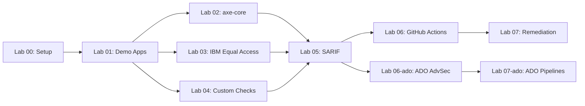

  

# Accessibility Scan Workshop

Welcome to the **Accessibility Scan Workshop** — a hands-on, progressive workshop that teaches you how to scan web applications for WCAG 2.2 accessibility violations using axe-core, IBM Equal Access, and custom Playwright checks.

All results are normalized to [SARIF v2.1.0](https://docs.oasis-open.org/sarif/sarif/v2.1.0/sarif-v2.1.0.html) for unified reporting in GitHub Advanced Security or Azure DevOps Advanced Security.

> [!NOTE]
> This workshop is part of the [Agentic Accelerator Framework](https://github.com/devopsabcs-engineering/agentic-accelerator-framework).

## Architecture Overview

## Prerequisites

- GitHub account with Copilot access
- Node.js 20+
- Docker Desktop
- Azure subscription (full-day tier only)
- PowerShell 7+

See [Lab 00: Prerequisites](labs/lab-00-setup.md) for detailed installation instructions.

## Labs

| # | Lab | Duration | Level |
|---|-----|----------|-------|
| 00 | [Prerequisites](labs/lab-00-setup.md) | 30 min | Beginner |
| 01 | [Explore Demo Apps](labs/lab-01.md) | 25 min | Beginner |
| 02 | [axe-core](labs/lab-02.md) | 35 min | Intermediate |
| 03 | [IBM Equal Access](labs/lab-03.md) | 30 min | Intermediate |
| 04 | [Custom Playwright Checks](labs/lab-04.md) | 35 min | Intermediate |
| 05 | [SARIF Output](labs/lab-05.md) | 30 min | Intermediate |
| 06 | [GitHub Actions](labs/lab-06.md) | 40 min | Advanced |
| 06-ADO | [ADO Advanced Security](labs/lab-06-ado.md) | 35 min | Intermediate |
| 07 | [Remediation (GitHub)](labs/lab-07.md) | 45 min | Advanced |
| 07-ADO | [Remediation (ADO)](labs/lab-07-ado.md) | 50 min | Advanced |

## Workshop Schedule

### Half-Day (3 hours)

| Time | Activity |
|------|----------|
| 0:00 – 0:30 | Lab 00: Prerequisites |
| 0:30 – 0:55 | Lab 01: Explore Demo Apps |
| 0:55 – 1:30 | Lab 02: axe-core |
| 1:30 – 2:00 | Lab 03: IBM Equal Access |
| 2:00 – 2:15 | Break |
| 2:15 – 2:55 | Lab 06: GitHub Actions (or Lab 06-ADO) |

### Full-Day (6.5 hours)

| Time | Activity |
|------|----------|
| 0:00 – 0:30 | Lab 00: Prerequisites |
| 0:30 – 0:55 | Lab 01: Explore Demo Apps |
| 0:55 – 1:30 | Lab 02: axe-core |
| 1:30 – 2:00 | Lab 03: IBM Equal Access |
| 2:00 – 2:35 | Lab 04: Custom Playwright Checks |
| 2:35 – 2:50 | Break |
| 2:50 – 3:20 | Lab 05: SARIF Output |
| 3:20 – 4:00 | Lab 06: GitHub Actions |
| 4:00 – 4:35 | Lab 06-ADO: ADO Advanced Security |
| 4:35 – 4:50 | Break |
| 4:50 – 5:35 | Lab 07: Remediation (GitHub) |
| 5:35 – 6:25 | Lab 07-ADO: Remediation (ADO) |

## Delivery Tiers

| Tier | Platform | Labs | Duration | Azure Required |
| --- | --- | --- | --- | --- |
| Half-Day (GitHub) | GitHub | 00, 01, 02, 03, 06 | ~3 hours | No |
| Half-Day (ADO) | ADO | 00, 01, 02, 03, 06-ado | ~3 hours | Yes |
| Full-Day (GitHub) | GitHub | 00–05, 06, 07 | ~6.5 hours | Yes |
| Full-Day (ADO) | ADO | 00–05, 06-ado, 07-ado | ~7 hours | Yes |
| Full-Day (Dual) | Both | 00–05, 06, 06-ado, 07, 07-ado | ~8.5 hours | Yes |

## Getting Started

1. **Fork or use this template** to create your own workshop instance.
2. Complete [Lab 00: Prerequisites](labs/lab-00-setup.md) to set up your environment.
3. Work through the labs in order — each lab builds on the previous one.

> **Tip**: This workshop is designed for GitHub Codespaces. Click **Code → Codespaces → New codespace** to get a pre-configured environment with all tools installed.
