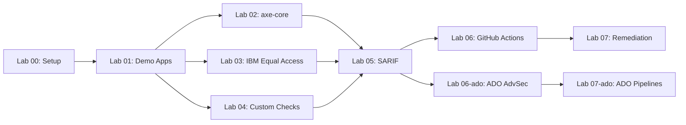

# Accessibility Scan Workshop

> [!NOTE]
> This workshop is part of the [Agentic Accelerator Framework](https://github.com/devopsabcs-engineering/agentic-accelerator-framework).

Complete hands-on labs to learn WCAG 2.2 accessibility scanning using
axe-core, IBM Equal Access, and custom Playwright checks.

## Lab Dependency Diagram

## Lab Checklist

- [ ] [Lab 00: Prerequisites and Environment Setup](labs/lab-00-setup.md)
- [ ] [Lab 01: Explore the Demo Apps and WCAG Violations](labs/lab-01.md)
- [ ] [Lab 02: axe-core — Automated Accessibility Testing](labs/lab-02.md)
- [ ] [Lab 03: IBM Equal Access — Comprehensive Policy Scanning](labs/lab-03.md)
- [ ] [Lab 04: Custom Playwright Checks — Manual Inspection](labs/lab-04.md)
- [ ] [Lab 05: SARIF Output and GitHub Security Tab](labs/lab-05.md)
- [ ] [Lab 06: GitHub Actions Pipelines and Scan Gates](labs/lab-06.md)
- [ ] [Lab 06-ado: ADO Advanced Security and SARIF Integration](labs/lab-06-ado.md)
- [ ] [Lab 07: Remediation Workflows with Copilot Agents](labs/lab-07.md)
- [ ] [Lab 07-ado: ADO YAML Pipelines for Accessibility Scanning](labs/lab-07-ado.md)

## Delivery Tiers

| Tier | Platform | Labs | Duration | Azure Required |
| --- | --- | --- | --- | --- |
| Half-Day (GitHub) | GitHub | 00, 01, 02, 03, 06 | ~3 hours | No |
| Half-Day (ADO) | ADO | 00, 01, 02, 03, 06-ado | ~3 hours | Yes |
| Full-Day (GitHub) | GitHub | 00–05, 06, 07 | ~6.5 hours | Yes |
| Full-Day (ADO) | ADO | 00–05, 06-ado, 07-ado | ~7 hours | Yes |
| Full-Day (Dual) | Both | 00–05, 06, 06-ado, 07, 07-ado | ~8.5 hours | Yes |

## Prerequisites

- GitHub account with Copilot access
- Node.js 20+
- Docker Desktop
- Azure subscription (full-day tier only)
- PowerShell 7+

## Getting Started

1. Fork and clone `devopsabcs-engineering/accessibility-scan-demo-app`
2. Run `npm install && npx playwright install --with-deps chromium`
3. Start the scanner: `./start-local.ps1`
4. Open [Lab 00](labs/lab-00-setup.md) and begin
