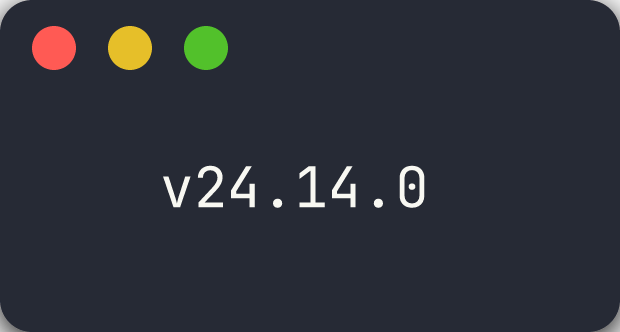
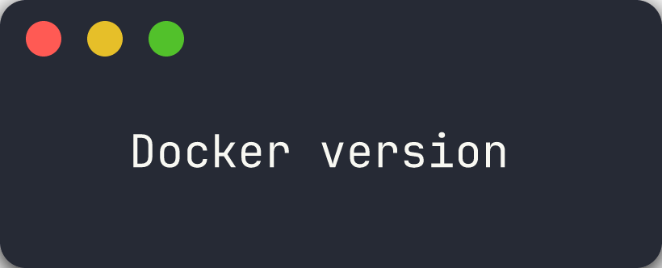
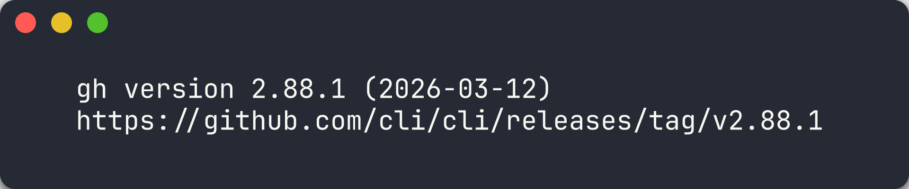
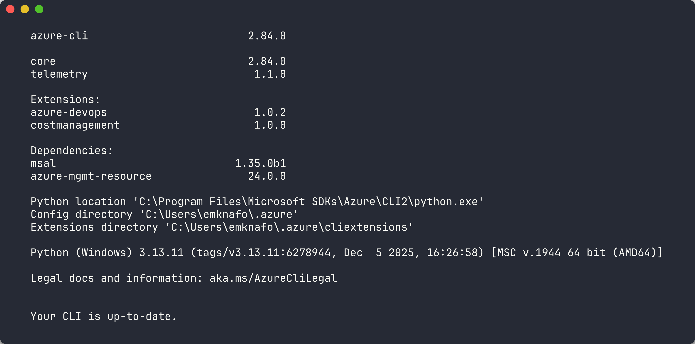
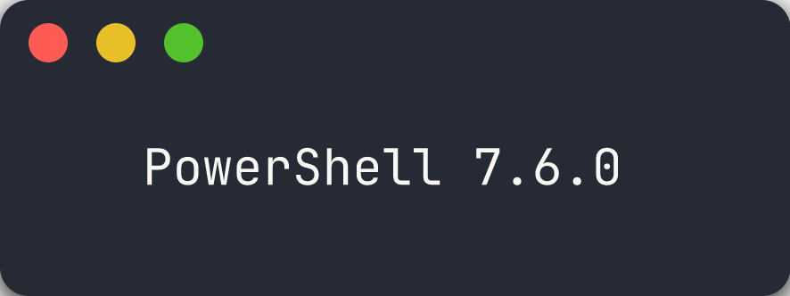
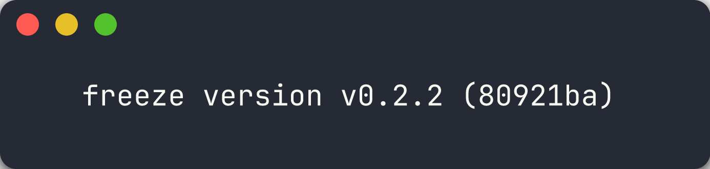
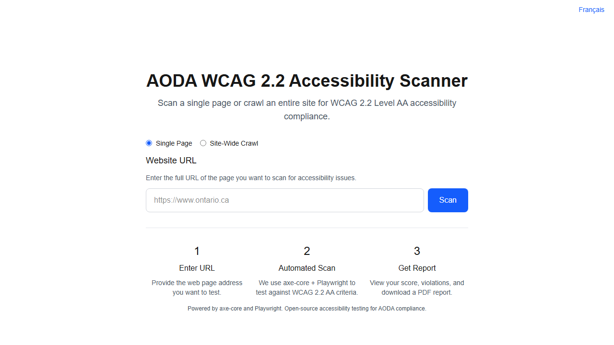

# Lab 00: Prerequisites and Environment Setup

> [!NOTE]
> This workshop is part of the [Agentic Accelerator Framework](https://github.com/devopsabcs-engineering/agentic-accelerator-framework).

| | |
|---|---|
| **Duration** | 30 minutes |
| **Level** | Beginner |
| **Prerequisites** | None |

## Learning Objectives

By the end of this lab, you will be able to:

- Fork and clone the `accessibility-scan-demo-app` repository
- Install the required tools (Node.js, Docker, GitHub CLI, Azure CLI, PowerShell 7+, Charm freeze)
- Verify all tool installations with version checks
- Install scanner dependencies and Playwright browsers
- Start the accessibility scanner locally and confirm it is running

## Exercises

### Exercise 0.1: Fork and Clone Repositories

You will fork the scanner repository so you have your own copy to work with.

1. Open a terminal (PowerShell 7+).

2. Fork and clone the scanner repository using the GitHub CLI:

   ```bash
   gh repo fork devopsabcs-engineering/accessibility-scan-demo-app --clone
   ```

3. Change into the cloned directory:

   ```bash
   cd accessibility-scan-demo-app
   ```

4. Verify the remote points to your fork:

   ```bash
   git remote -v
   ```

   You should see your GitHub username in the `origin` URL.

5. Fork and clone the workshop repository:

   ```bash
   gh repo fork devopsabcs-engineering/accessibility-scan-workshop --clone
   ```

> [!TIP]
> If you do not have the GitHub CLI installed yet, you will install it in the next exercise. You can also fork via the GitHub web UI and clone manually with `git clone`.

### Exercise 0.2: Install Required Tools

You will install the tools used throughout the workshop.

1. **Node.js 20+** — Download from [nodejs.org](https://nodejs.org/) or install via a package manager:

   ```powershell
   # Windows
   winget install OpenJS.NodeJS.LTS
   ```

   ```bash
   # macOS
   brew install node@20
   ```

2. **Docker Desktop** — Download from [docker.com](https://www.docker.com/products/docker-desktop/) or install via a package manager:

   ```powershell
   # Windows
   winget install Docker.DockerDesktop
   ```

3. **GitHub CLI** — Install the `gh` CLI:

   ```powershell
   # Windows
   winget install GitHub.cli
   ```

   ```bash
   # macOS
   brew install gh
   ```

4. **Azure CLI** — Install `az`:

   ```powershell
   # Windows
   winget install Microsoft.AzureCLI
   ```

   ```bash
   # macOS
   brew install azure-cli
   ```

5. **PowerShell 7+** — Install the latest PowerShell:

   ```powershell
   # Windows
   winget install Microsoft.PowerShell
   ```

   ```bash
   # macOS
   brew install powershell/tap/powershell
   ```

6. **Charm freeze** — Install the terminal screenshot tool:

   ```powershell
   # Windows
   winget install charmbracelet.freeze
   ```

   ```bash
   # macOS
   brew install charmbracelet/tap/freeze
   ```

> [!TIP]
> On Windows, run these commands in an elevated PowerShell terminal. Restart your terminal after installation so the tools are available on your PATH.

### Exercise 0.3: Verify Tool Versions

You will run version checks to confirm every tool is installed correctly.

1. **Node.js:**

   ```bash
   node --version
   ```

   Expected output: `v20.x.x` or higher.

   

2. **Docker:**

   ```bash
   docker --version
   ```

   Expected output: `Docker version 2x.x.x` or higher.

   

3. **GitHub CLI:**

   ```bash
   gh --version
   ```

   

4. **Azure CLI:**

   ```bash
   az --version
   ```

   

5. **PowerShell:**

   ```powershell
   $PSVersionTable.PSVersion
   ```

   Expected output: `7.x.x` or higher.

   

6. **Charm freeze:**

   ```bash
   freeze --version
   ```

   

> [!CAUTION]
> If any tool fails the version check, resolve the installation issue before proceeding. Later labs depend on all tools being available.

### Exercise 0.4: Install Scanner Dependencies

You will install the Node.js dependencies and Playwright browser required by the scanner.

1. Navigate to the scanner repository root:

   ```bash
   cd accessibility-scan-demo-app
   ```

2. Install Node.js dependencies:

   ```bash
   npm install
   ```

3. Install the Playwright Chromium browser:

   ```bash
   npx playwright install --with-deps chromium
   ```

> [!NOTE]
> The Playwright browser download is approximately 150 MB. This browser is used by the scanner to render pages and run accessibility checks.

### Exercise 0.5: Start the Scanner Locally

You will start the accessibility scanner and verify it is running.

1. Start the scanner using the local start script:

   ```powershell
   ./start-local.ps1
   ```

   The script starts the Next.js development server on port 3000.

2. Open your browser and navigate to:

   ```text
   http://localhost:3000
   ```

3. Verify the scanner home page loads with the scan form visible.

   

4. Leave the scanner running for use in subsequent labs.

> [!TIP]
> If port 3000 is already in use, stop the conflicting process or run `./stop-local.ps1` first. You can also start the scanner with Docker using `./start-local.ps1 -Mode docker`.

## Verification Checkpoint

Before proceeding, verify:

- [ ] Repository forked and cloned locally
- [ ] All 6 tools installed and returning version output (Node.js, Docker, gh, az, pwsh, freeze)
- [ ] `npm install` completed without errors
- [ ] Playwright Chromium browser installed
- [ ] Scanner running at `http://localhost:3000`

## Next Steps

Proceed to [Lab 01: Explore the Demo Apps and WCAG Violations](lab-01.md).
