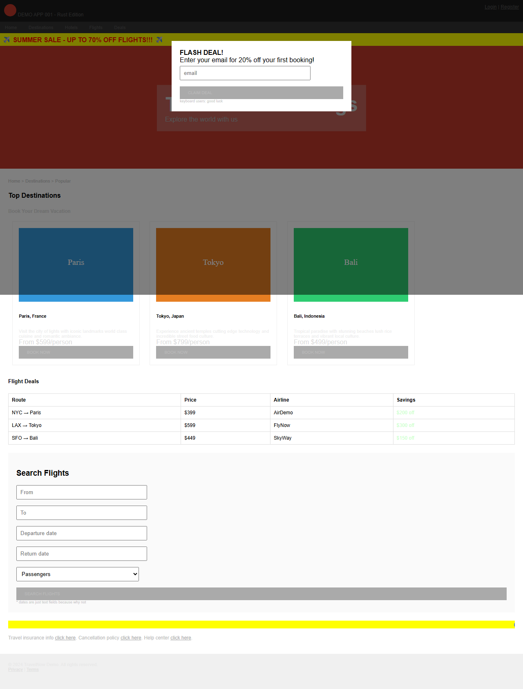
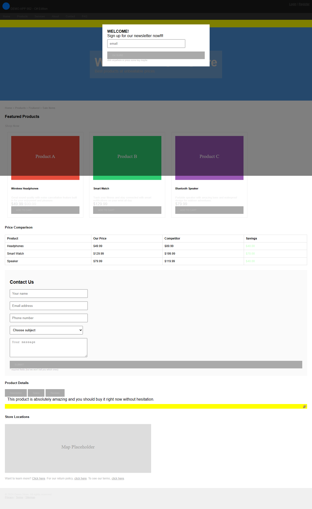
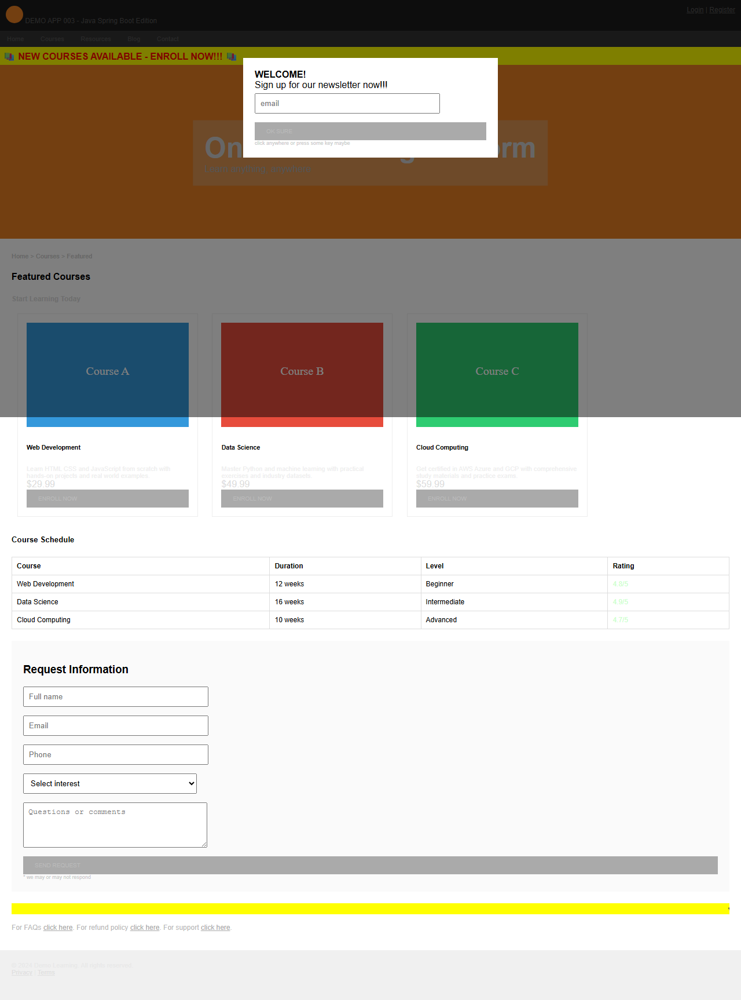
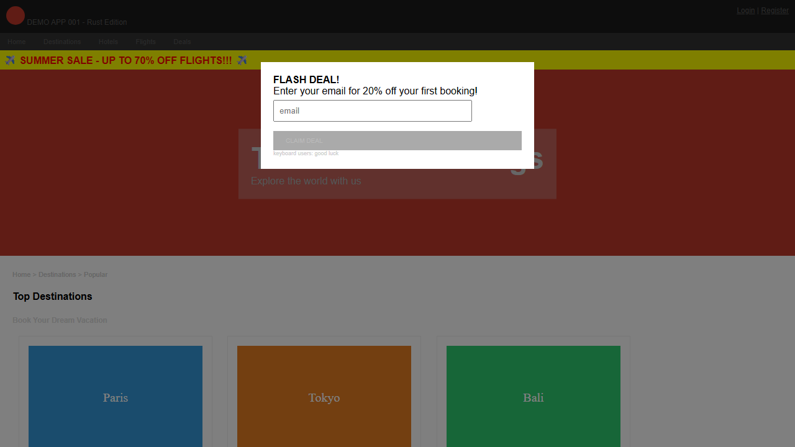

# Lab 01: Explore the Demo Apps and WCAG Violations

| | |
|---|---|
| **Duration** | 25 minutes |
| **Level** | Beginner |
| **Prerequisites** | [Lab 00](lab-00-setup.md) |

## Learning Objectives

By the end of this lab, you will be able to:

- Describe the 5 demo apps, their tech stacks, and violation themes
- Build and run a demo app locally using Docker
- Identify visible accessibility violations in a web page
- Map violations to the WCAG 2.2 POUR principles (Perceivable, Operable, Understandable, Robust)

## Exercises

### Exercise 1.1: Review the Demo App Matrix

The scanner repository includes 5 deliberately inaccessible web applications, each built with a different technology stack. All 5 apps share the same core WCAG violations but use different themes.

1. Review the demo app matrix:

   | App | Language | Framework | Theme | Port | Violation Categories |
   |-----|----------|-----------|-------|------|----------------------|
   | 001 | Rust | Actix-web | Travel Booking | 8001 | Missing lang, no title, popup trap, keyboard trap, no focus indicator, poor contrast, heading hierarchy, marquee/blink, no labels, no table headers, ambiguous links |
   | 002 | C# | ASP.NET 8 | E-Commerce Store | 8002 | All of 001 + inaccessible tab interface, inaccessible image map |
   | 003 | Java | Spring Boot | Online Learning | 8003 | Same core violations as 001 with education-themed content |
   | 004 | Python | Flask | Recipe Site | 8004 | Same core violations as 001 with recipe-themed content |
   | 005 | Go | net/http | Fitness Tracker | 8005 | Same core violations as 001 with fitness-themed content |

2. Note that all 5 apps intentionally include 15+ WCAG violation categories. These are your test targets throughout the workshop.

### Exercise 1.2: Build and Run Demo App 001

You will build and run the first demo app locally to explore its violations.

1. Build the Docker image for demo app 001:

   ```bash
   docker build -t a11y-demo-app-001 ./a11y-demo-app-001
   ```

2. Run the container:

   ```bash
   docker run -d --name a11y-001 -p 8001:8080 a11y-demo-app-001
   ```

3. Open your browser and navigate to:

   ```text
   http://localhost:8001
   ```

4. You should see the **TravelNow Bookings** travel site.

   

> [!TIP]
> To build and run additional demo apps, repeat the pattern with the appropriate directory and port:
>
> ```bash
> docker build -t a11y-demo-app-002 ./a11y-demo-app-002
> docker run -d --name a11y-002 -p 8002:8080 a11y-demo-app-002
> ```
>
> 
>
> 

### Exercise 1.3: Identify Visible Violations

You will explore demo app 001 and identify accessibility violations you can see without any tools.

1. When the page loads, notice the **popup modal** that appears. Try pressing `Tab` or `Escape` — the modal cannot be closed with the keyboard.

   

2. Close the modal by clicking the X button with your mouse. Then observe the following:

   - **Missing alt text** — Images of destinations (Paris, Tokyo, Bali) have no alternative text. Hover over them and notice no tooltip appears.
   - **Poor color contrast** — Text throughout the page uses light colours on dark backgrounds (for example, grey text on dark grey sections).
   - **Heading hierarchy** — The page jumps from `<h4>` to `<h1>` to `<h6>`, violating logical heading order.
   - **Tiny text** — Several elements use 9px or 11px font sizes, making them difficult to read.
   - **Marquee element** — A scrolling `<marquee>` banner creates distracting motion.
   - **"Click here" links** — Links use vague text like "click here" instead of describing their destination.

3. Open Chrome DevTools (`F12`) and run a **Lighthouse Accessibility Audit**:
   - Navigate to the **Lighthouse** tab
   - Select **Accessibility** as the category
   - Click **Analyze page load**

   

4. Review the Lighthouse score. Demo app 001 typically scores below 50 due to the volume of violations.

### Exercise 1.4: Map Violations to WCAG Principles

WCAG 2.2 organizes accessibility requirements into 4 principles known as **POUR**. You will map the violations you found to these principles.

1. Review the POUR principles and their demo app examples:

   | Principle | Description | Demo App Examples |
   |-----------|-------------|-------------------|
   | **Perceivable** | Information must be presentable in ways users can perceive | Missing alt text (1.1.1), poor contrast (1.4.3), tiny text (1.4.4) |
   | **Operable** | UI components must be operable by all users | Keyboard trap (2.1.2), no skip nav (2.4.1), no page title (2.4.2), ambiguous links (2.4.4), marquee/blink (2.3.1) |
   | **Understandable** | Information and UI operation must be understandable | Missing lang attribute (3.1.1), no form labels (3.3.2) |
   | **Robust** | Content must be robust enough for assistive technologies | Deprecated elements like `<font>` and `<marquee>` (4.1.1), divs as buttons without ARIA roles (4.1.2) |

   

2. For each violation you identified in Exercise 1.3, determine which POUR principle it falls under. Most demo app violations span all 4 principles.

> [!NOTE]
> WCAG 2.2 Level AA has 55 success criteria across these 4 principles. The demo apps violate criteria from every principle, making them comprehensive test targets for the scanner tools you will use in Labs 02–04.

## Verification Checkpoint

Before proceeding, verify:

- [ ] Can name all 5 demo apps and their tech stacks
- [ ] Demo app 001 is running at `http://localhost:8001`
- [ ] Identified at least 5 visible violations in demo app 001
- [ ] Can explain the 4 WCAG POUR principles with examples from the demo apps

## Next Steps

Proceed to [Lab 02: axe-core — Automated Accessibility Testing](lab-02.md).
