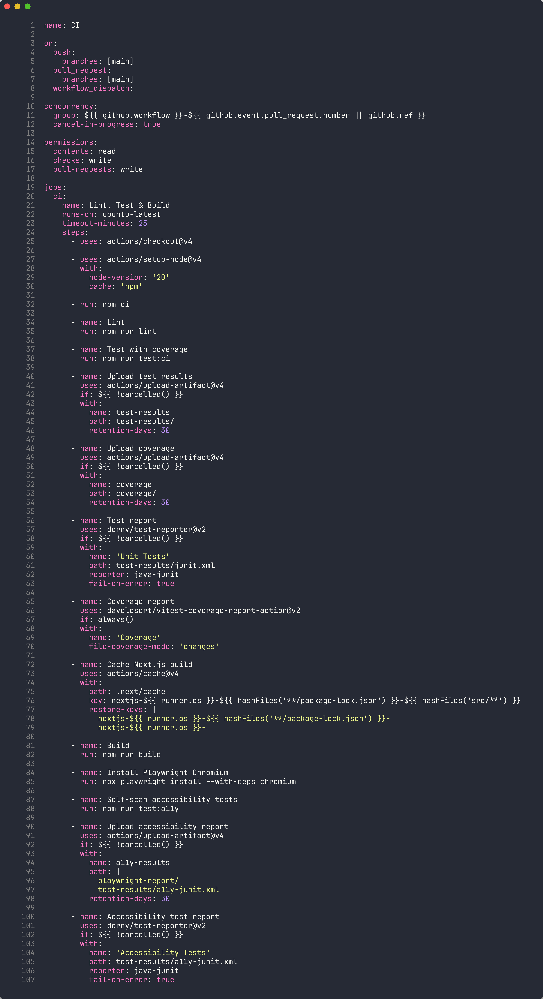
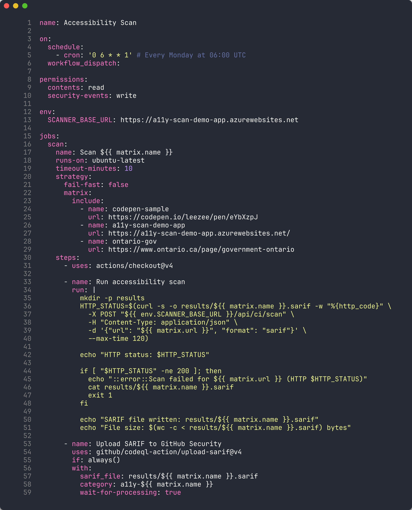
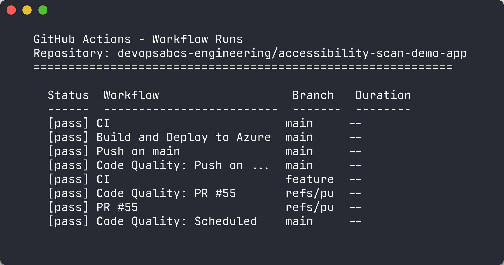
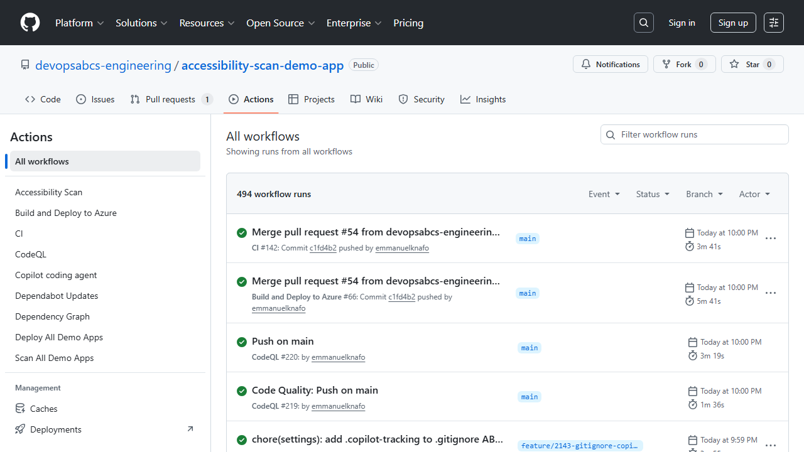
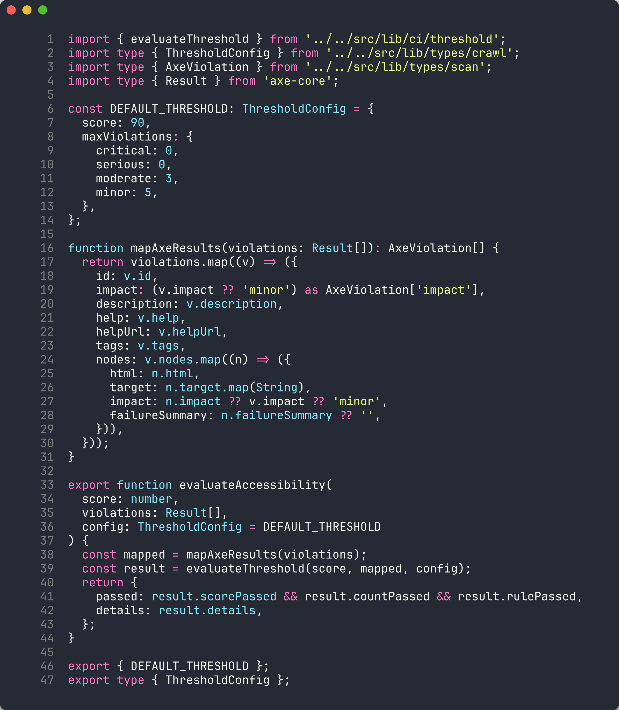

# Lab 06: GitHub Actions Pipelines and Scan Gates

| | |
|---|---|
| **Duration** | 40 minutes |
| **Level** | Advanced |
| **Prerequisites** | [Lab 05](lab-05.md), Azure subscription (Exercises 6.3–6.5) |

> [!TIP]
> This lab covers the **GitHub Actions** workflow. For the Azure DevOps
> variant, see [Lab 06-ado: ADO Advanced Security](lab-06-ado.md).

## Learning Objectives

By the end of this lab, you will be able to:

- Review the CI workflow structure and understand its build/test/scan pipeline
- Understand the scan workflow's matrix strategy for scanning multiple apps
- Configure OIDC authentication for GitHub Actions to Azure
- Bootstrap demo app repos using the provided scripts
- Trigger and monitor multi-app deployment workflows
- Configure threshold-based scan gates to enforce minimum accessibility scores

## Exercises

### Exercise 6.1: Review CI Workflow

You will examine the scanner's CI pipeline to understand how accessibility testing integrates into the build process.

1. Open `.github/workflows/ci.yml` in your editor.

2. Review the workflow structure:

   ```yaml
   name: CI

   on:
     push:
       branches: [main]
     pull_request:
       branches: [main]

   jobs:
     lint:
       # ESLint checks...
     test:
       # Vitest unit tests...
     build:
       # Next.js production build...
     e2e:
       # Playwright end-to-end tests including self-scan...
   ```

3. Note the key stages:

   | Stage | Purpose |
   |-------|---------|
   | **lint** | Runs ESLint to enforce code quality and catch common issues |
   | **test** | Runs Vitest unit tests for scanner components (engine, parsers, formatters) |
   | **build** | Creates a production Next.js build to verify compilation |
   | **e2e** | Runs Playwright tests that scan the scanner's own pages for accessibility |

   

4. The `e2e` job is particularly interesting — it performs a **self-scan**, scanning the scanner's own UI for accessibility violations. This ensures the scanner tool itself meets WCAG standards.

### Exercise 6.2: Review Scan Workflow

You will examine the multi-app scan workflow that scans all 5 demo apps using a matrix strategy.

1. Open `.github/workflows/a11y-scan.yml` in your editor.

2. Review the matrix strategy:

   ```yaml
   strategy:
     matrix:
       include:
         - app: a11y-demo-app-001
           url: https://a11y-demo-app-001.azurewebsites.net
         - app: a11y-demo-app-002
           url: https://a11y-demo-app-002.azurewebsites.net
         # ... apps 003-005
   ```

3. Each matrix job:
   - Scans the deployed demo app at its Azure URL
   - Generates SARIF output
   - Uploads findings to the Security tab via `codeql-action/upload-sarif`

   

4. Review the `scan-all.yml` workflow that dispatches scan jobs to all 5 sibling repos:

   ```yaml
   # scan-all.yml dispatches the a11y-scan workflow
   # to each demo app repository
   ```

### Exercise 6.3: Configure OIDC Authentication

> [!NOTE]
> This exercise requires an Azure subscription (full-day tier only).

You will configure OpenID Connect (OIDC) federated credentials so GitHub Actions can authenticate to Azure without storing secrets.

1. Ensure you are logged into the Azure CLI:

   ```bash
   az login
   ```

2. Run the OIDC setup script from the scanner repository:

   ```powershell
   ./scripts/setup-oidc.ps1
   ```

3. The script performs 5 steps:
   - **App registration** — Creates or retrieves an Azure AD app named `a11y-scanner-github-actions`
   - **Federated credentials** — Creates OIDC credentials for the scanner repo and each demo app repo
   - **Service principal** — Creates or retrieves the service principal
   - **Role assignment** — Grants `Contributor` role on the subscription
   - **Summary** — Displays the Client ID, Tenant ID, and Subscription ID

   

4. Configure the output values as GitHub repository secrets:

   ```bash
   gh secret set AZURE_CLIENT_ID --body "<client-id>"
   gh secret set AZURE_TENANT_ID --body "<tenant-id>"
   gh secret set AZURE_SUBSCRIPTION_ID --body "<subscription-id>"
   ```

### Exercise 6.4: Bootstrap Demo App Repos

> [!NOTE]
> This exercise requires an Azure subscription (full-day tier only).

You will create the 5 demo app repositories from the template directories.

1. Run the bootstrap script:

   ```powershell
   ./scripts/bootstrap-demo-apps.ps1
   ```

2. The script creates 5 public repositories under your GitHub account:
   - `a11y-demo-app-001` through `a11y-demo-app-005`
   - Each repo receives the code from the corresponding template directory
   - OIDC secrets, topics, and environments are configured automatically

3. Verify the repos were created:

   ```bash
   gh repo list --limit 10 | grep a11y-demo-app
   ```

### Exercise 6.5: Trigger Deploy-All Workflow

> [!NOTE]
> This exercise requires an Azure subscription (full-day tier only).

You will deploy all 5 demo apps to Azure.

1. Trigger the deploy-all workflow:

   ```bash
   gh workflow run deploy-all.yml
   ```

2. Monitor the deployment progress:

   ```bash
   gh run watch
   ```

   

3. The deploy-all workflow dispatches CI/CD to each demo app repository. Each app is deployed to its own Azure resource group (`rg-a11y-demo-001` through `rg-a11y-demo-005`).

   

4. After deployment, verify the apps are accessible:

   ```bash
   curl -s -o /dev/null -w "%{http_code}" https://a11y-demo-app-001.azurewebsites.net
   ```

   

> [!IMPORTANT]
> The demo apps deploy to Azure App Service and incur real costs. Run the teardown workflow or delete the resource groups after completing the workshop.

### Exercise 6.6: Configure Threshold Gates

You will configure scan score thresholds to enforce minimum accessibility standards.

1. Review the scanner's threshold configuration. The CLI supports a `--threshold` flag:

   ```bash
   npx ts-node src/cli/commands/scan.ts --url http://localhost:8001 --threshold 70
   ```

   The command exits with a non-zero code if the score is below the threshold, failing the pipeline.

2. Create or update a workflow that uses the threshold as a quality gate:

   ```yaml
   - name: Scan for accessibility
     run: |
       npx ts-node src/cli/commands/scan.ts \
         --url ${{ matrix.url }} \
         --threshold 70 \
         --format sarif \
         --output results/${{ matrix.app }}.sarif
   ```

3. When the scan score falls below the threshold, the step fails and the workflow is marked as failed. This prevents deployment of apps that do not meet the minimum accessibility standard.

   

> [!TIP]
> Start with a low threshold (for example, 30) for existing apps with many violations, and gradually increase it as violations are remediated. A threshold of 70 is a reasonable target for production applications.

## Verification Checkpoint

Before proceeding, verify:

- [ ] Reviewed the CI workflow structure and understand the self-scan pattern
- [ ] Understand the matrix strategy in the scan workflow
- [ ] (Full-day) Configured OIDC authentication for GitHub Actions
- [ ] (Full-day) Bootstrapped demo app repos using the script
- [ ] (Full-day) Triggered and monitored a deploy-all workflow
- [ ] Understand how threshold gates enforce minimum accessibility scores

## Next Steps

Proceed to [Lab 07: Remediation Workflows with Copilot Agents](lab-07.md).
